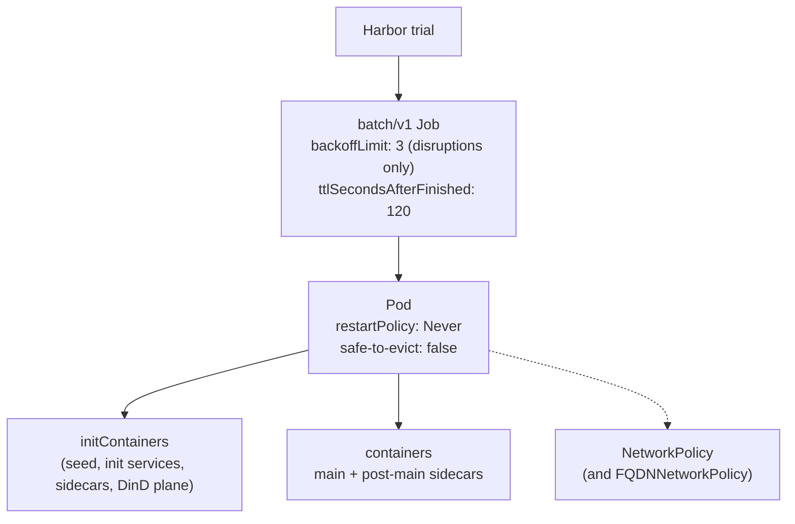
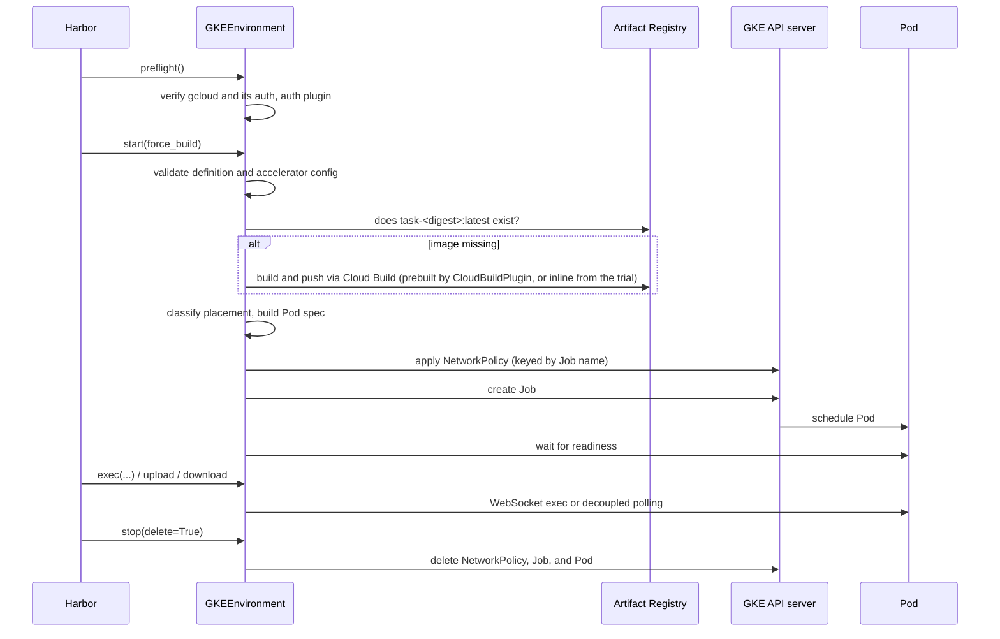

# Architecture

How `harbor-gke-ext` turns a Harbor trial into Google Kubernetes Engine (GKE)
workloads, which module owns which decision, and the invariants that hold across
the whole package.

Read this before you read any other design document. The remaining documents
drill into one subsystem each and assume the vocabulary defined here.

## Where this package sits

Harbor separates *what to run* (a task) from *where to run it* (an environment).
An environment is any class that implements `harbor.environments.base.BaseEnvironment`.
Harbor calls a small, fixed set of methods on it: `start()`, `exec()`, the file
transfer methods, and `stop()`.

`harbor-gke-ext` is one such implementation. It is distributed as a separate
Python package rather than as part of Harbor, and you select it by import path:

```bash
harbor run -t hello-world/hello-world -e harbor_gke_ext:GKEEnvironment \
  --ek project_id=my-project \
  --ek location=us-central1 \
  --ek cluster_name=my-cluster
```

It is an extended alternative to Harbor's built-in `gke` environment. It
implements the same contract and reuses Harbor's task format unchanged, so any
task that runs under the Docker environment is a candidate to run here without
modification. What it adds is Docker Compose translation, accelerator support,
network isolation, and the resilience machinery needed to keep thousands of
concurrent trials alive against a remote API server.

> [!NOTE]
> `GKEEnvironment.type()` returns the string `"gke"`. That value is a label
> Harbor uses for reporting; it does not affect which class gets loaded. The
> loader string `harbor_gke_ext:GKEEnvironment` is what selects this package.

## The execution model

One trial maps to one Kubernetes Job, which owns exactly one Pod, which contains
one or more containers. Nothing is shared between trials.



Five deliberate choices shape everything downstream:

| Choice | Value | Reason |
| --- | --- | --- |
| Workload kind | `batch/v1` Job | Gives a terminal state and a controller-managed cleanup path that a bare Pod does not have. |
| `backoffLimit` and `podFailurePolicy` | `3` (`_GKE_JOB_BACKOFF_LIMIT`); `DisruptionTarget` counts, any container failure fails the Job | A trial is a measurement. The Job replaces only a Pod lost to infrastructure (preemption, eviction, node loss), and Harbor adopts a replacement only until `start()` returns, so an agent never runs twice and a trial never moves to another Pod. |
| `ttlSecondsAfterFinished` | `120` | Bounds the lifetime of finished objects so a large sweep cannot accumulate garbage in the namespace. |
| `restartPolicy` | `Never` | A crashed container fails the Pod instead of restarting in place. `podFailurePolicy` requires it. |
| `cluster-autoscaler.kubernetes.io/safe-to-evict` | `"false"` | Prevents the autoscaler from reclaiming a node underneath a trial that is mid-run. |

The rationale behind each is recorded in [Design decisions](design-decisions.md).

## Pod shapes and Compose placement

The environment emits one of three Pod shapes (`Shape A`, `Shape B`, or `Shape C`).
Which one it picks is decided by `placement.py` before any Kubernetes object is
created. For Compose tasks, the choice is recorded on the Pod through these
annotations:

- `harbor.dev/compose-placement-shape`: `A`, `B`, or `C`.
- `harbor.dev/compose-placement`: `native` (Shape A) or `dind` (Shapes B and C).
- `harbor.dev/compose-placement-summary`: JSON with the shape, `dind_reasons`,
  and warnings.
- `harbor.dev/dind-delegated-services`: a JSON list of the services that run in
  `dind-engine` (Shapes B and C only).

Single-container Pods are always Shape A and carry no shape annotation.

| Shape | When | Structure |
| --- | --- | --- |
| **Shape A — Native Pod** | Single-container tasks (no `docker-compose.yaml`) or Compose tasks where every service can run as a native Kubernetes container | Single-container tasks run one `main` container with no `initContainers`. Multi-container Compose tasks run `harbor-seed`, one-shot init services, and KEP-753 sidecars (`initContainers` with `restartPolicy: Always`), followed by `main` and any post-main sidecars. |
| **Shape B — Hybrid (`main` native + DinD sidecars)** | Compose tasks where `main` can run natively, but at least one sidecar requires DinD features | `main` remains a primary native Pod container (preserving direct GKE Image Streaming and GPU/TPU device plugin mounts). Delegated sidecars are pulled into a `dind-engine` sidecar by `dind-cache-<svc>` initContainers and started by `compose-up-gate`. |
| **Shape C — Main-in-DinD** | Compose tasks where `main` itself requires DinD features (`privileged: true`, `/var/run/docker.sock`, non-GPU `devices`, unsafe `sysctls`, an `external: true` volume, or `DIND_KEYS` such as `ulimits`) | `main` and every sidecar, one-shot services included, run inside `dind-engine` with `container_name: <service>` (e.g., `main`). The Kubernetes `main` container is a lightweight lifecycle mirror: `docker:dind` running `docker wait main` against the in-Pod daemon, so the Pod container exits with the inner `main`'s status. `connect_exec_stream()` in `exec_engine.py` wraps commands targeting `dind_services` as `docker exec [-i] [-t] <service> ...` inside that native `main` Pod container. |

### How `placement.py` classifies Compose features

- **Native keys (`NATIVE_KEYS`)**: Standard Compose directives—including `cap_add`, `cap_drop`, `cpus`, `mem_limit`, `deploy`, `healthcheck`, `depends_on`, `volumes`, `ports`, `expose`, `networks`, `tmpfs`, `shm_size`, and safe `sysctls`—translate directly to native Kubernetes container fields without triggering DinD. `security_opt` is also listed in `NATIVE_KEYS`, but it is accepted and ignored rather than translated.
- **Per-service DinD triggers (`dind_reasons`)**:
  - `PRIVILEGED`: `privileged: true`.
  - `DOCKER_SOCK`: mounting `/var/run/docker.sock`.
  - `DEVICE_NON_GPU`: entries in `devices` other than `/dev/nvidia*` and `/dev/dri*` (GPU devices are handled via the GKE device plugin).
  - `UNSAFE_SYSCTL`: `sysctls` outside Kubernetes safe sysctl prefixes (`SAFE_SYSCTL_PREFIXES`).
  - `EXTERNAL_VOLUME`: top-level `external: true` volumes.
  - Keys in `DIND_KEYS` (`ulimits`, `init`, `blkio_config`, `cpuset`, `cpu_count`, `cpu_percent`, `cpu_period`, `cpu_quota`, `cpu_rt_runtime`, `cpu_rt_period`, `oom_kill_disable`, `oom_score_adj`, `mem_swappiness`, `memswap_limit`, `pids_limit`, `storage_opt`, `device_cgroup_rules`) record a per-key reason formatted as `CODE:key`, such as `ULIMITS:ulimits`, `INIT_PID1:init`, `CPU_LEGACY:cpu_quota`, `OOM:oom_score_adj`, `SWAP:memswap_limit`, or `PIDS_LIMIT:pids_limit`.
  - **Sidecar-only DinD triggers**: `USER_BY_NAME` (a non-numeric, non-`root` symbolic `user` on a sidecar), `PORT_COLLISION` (multiple services exposing the same port), and `MULTI_NETWORK` (when the project defines more than one network, a sidecar attached to more than one of them that shares at least one with `main`).
- **Mode overrides and fatal errors (`UnsupportedComposeFeatureError`)**:
  - `pid: host` and `ipc: host`, and any use of `uts` or `userns_mode`, raise fatal `HOST_NAMESPACE` (they are never DinD triggers).
  - Under `compose_placement=native`, if `main` has DinD triggers the classifier raises `MAIN_NEEDS_DIND`; if only sidecars have DinD triggers it raises `NATIVE_PLACEMENT_REJECTED` (sidecars only).

### Where CPU and memory budgets live

Under the default `--cpus auto --memory auto`, `GKEEnvironment` resolves `auto` to `request` (`_GKE_DEFAULT_RESOURCE_AUTO_MODE = ResourceMode.REQUEST`):

- **Direct (single-container) Pods**: When limits are omitted (the default `auto` / `request` mode) or scaled via `cpu_limit_multiplier` / `memory_limit_multiplier`, `build_direct_pod()` places the budget on `pod.spec.resources` (`Burstable` QoS), allowing short compilation and test spikes to burst into idle node capacity. When both CPU and memory have `request == limit` (`--cpus guarantee --memory guarantee` or multiplier `1.0`), `build_direct_pod()` places the CPU and memory requests and limits directly on the `main` container rather than `pod.spec.resources`. This grants the Pod `Guaranteed` QoS and makes it eligible for exclusive CPU cores on nodes with `cpuManagerPolicy: static`.
- **Compose Pods** (Shapes A, B and C): the task budget sits on `main` (container-level in Shapes A and B, inner Compose `deploy.resources` in Shape C), and `build_pod_level_resources()` sets `pod.spec.resources`: the request covers the budget and every container request, and the ceiling is the sum of every container's ceiling (its limit, else its request), never below the request, including under `--cpus auto --memory auto` and `--cpus request --memory request`. The Pod plays the Docker host of its services, with a ceiling.
- **DinD Pods** (Shape B and Shape C): `dind-engine` requests a daemon baseline plus the DinD services' declared reservations and sets no limit of its own; its Pod ceiling counts as the baseline plus the DinD services' ceilings. `dockerd` nests its containers under `dind-engine`'s cgroup, so they are bounded by the Pod ceiling and removed with the Pod. See [Docker-in-Docker](docker-in-docker.md#resource-model-and-volume-topology).

[Compose translation](compose-translation.md) explains the classifier rules in full, and
[Docker-in-Docker](docker-in-docker.md) covers Shapes B and C in detail.

## Lifecycle



`preflight()` is a class method that runs once before any environment is
constructed. It fails fast when `gcloud` is missing or
`gcloud` has no active authenticated account (unless
`GOOGLE_APPLICATION_CREDENTIALS` points at a file). It warns when
`gke-gcloud-auth-plugin` is absent, because GKE 1.26 and later require it for
authentication. It does not check for a kubeconfig: Harbor calls it without
the environment's arguments, so it cannot know the target cluster, and the
client fetches credentials for that cluster itself when no kubeconfig context
matches it.

During `start()`, `_apply_network_policy()` runs **before** `_create_pod()` creates
the `batch/v1` Job (whenever `network_mode != PUBLIC` or `allow_metadata_server` is
`False`), so the Pod never boots with an unguarded network window. Start-time
`NetworkPolicy` and `FQDNNetworkPolicy` objects are keyed by `policy_key=self.job_name`
(`harbor-netpol-<job_name>` and `harbor-fqdn-<job_name>`) and have no `ownerReferences`
because the Pod UID does not exist yet; `stop(delete=True)` deletes them explicitly
alongside the Job and Pod. If `_apply_network_policy()` is called again while the Pod
is running (for example, to widen the allowlist during the agent phase), the updated
policy objects attach a Pod `ownerReference` (`uid=self.pod.metadata.uid`) and wait
`network_policy_settlement_sec` (default `2.0` s) when the Pod is already Ready.

[Runtime](runtime.md) covers everything from `start()` onwards, including the
exec transports and the retry budgets.

## Module map

| Module | Responsibility |
| --- | --- |
| `environment.py` | `GKEEnvironment` itself: the `BaseEnvironment` contract, Pod and Job assembly, readiness, exec, file transfer, teardown, storage and ComputeClass resolution. |
| `compose_translator.py` | Turns a normalized Compose project into containers, volumes, the Docker-in-Docker plane, `build_pod_level_resources()`, and `_GKENativeComposeServiceTransport`. |
| `exec_engine.py` | Exec handshakes (`connect_exec_stream()`), command execution helpers, the supervised and decoupled launch scripts, the kill script, the recovery probe and poll loop, and tar-based file transfer. |
| `placement.py` | The classifier that decides, per service, native or Docker-in-Docker or fatal, and reconciles GPU declarations. |
| `exec_stream.py` | The single-threaded exec stream reactor: non-blocking WebSocket I/O, frame parsing, keepalive pings, exit-status parsing, and incremental output decoding. |
| `prebuild.py` | `CloudBuildPlugin` and the `harbor-gke-ext-prebuild` entry point for warming a registry ahead of a large job. |
| `client.py` | `KubernetesClientManager`: cluster credential and kubeconfig context resolution (one cluster per process), per-caller timeout-bounded `ApiClient`s, and the exec-handshake thread pool. |
| `cluster_probe.py` | Probes GKE Standard and Autopilot cluster capabilities (node pools, taints, NAP limits, machine-type inventory, `ephemeral-storage` ceiling, `spec.resources`, `FQDNNetworkPolicy` support, and Autopilot DinD admission), and provides `ClusterAdmissionController`, which queues trials before Pod creation when in-flight Pods would exceed the cluster's schedulable CPU budget (overall or gVisor) or the optional `max_concurrent_pods` limit. |
| `cloud_build.py` | Artifact Registry URL resolution, image existence checks, and gated Cloud Build submission. |
| `image_plan.py` | Discovers every build context in a dataset (agent, verifier, Compose sidecars) and computes content digests. |
| `compose_spec.py` | Normalizes Compose input through the official `docker compose config --format json` CLI. |
| `network_policy.py` | Builds and reconciles `NetworkPolicy` and `FQDNNetworkPolicy` objects. |
| `image_ref.py` | The single chokepoint (`ImageResolver`) through which every Compose Pod image string must pass. |
| `pod_builder.py` | `build_direct_pod()` and `build_job()`: the single-container shape and the Job wrapper. |
| `constants.py` | Accelerator label maps, timeout and retry constants, error types, name sanitization. |
| `control_plane.py` | Adaptive back-pressure for Kubernetes control-plane calls: `is_control_plane_overload()` (HTTP 429 or 503, or a 5xx caused by a failed admission-webhook call), the process-wide AIMD `AdaptiveConcurrencyLimiter` shared by exec handshakes and Job and Pod writes, and `jittered_backoff_delay()`. |
| `__init__.py` | Public exports. |

The public surface is intentionally small. `__init__.py` exports
`GKEEnvironment`, `CloudBuildPlugin`, `KubernetesClientManager`, and the
`_HAS_KUBERNETES` availability flag. Everything else is internal and may change.

## Invariants

These hold across the package. They are the properties you can rely on when
reasoning about a Pod this code produced, and the ones to check first when
something behaves unexpectedly.

**Zero `hostPath` volumes.** Pod volumes use `emptyDir` by default. When
`scratch_volume_size` is configured, Compose named volumes and the DinD storage
volume use per-Pod Kubernetes generic ephemeral volumes
(`ephemeral.volumeClaimTemplate`) instead. There is not a single `hostPath` volume
anywhere in the package. A task cannot reach the node filesystem through a
volume, and nothing a task writes survives the Pod. This is what makes the
Docker-in-Docker plane safe to offer at all.

**Explicit `dind_services` routing and bare `<service>` container naming.** In
Shape B and Shape C, inner DinD containers are created with `container_name: <service>`
(the bare service name, e.g. `main`, **not** `harbor-<service>-1`). The set of
services delegated to `dind-engine` is recorded on the Pod annotation
`harbor.dev/dind-delegated-services` at spec-build time and stored on
`GKEEnvironment._dind_services` (`frozenset[str]`). Two complementary paths route
into those inner containers:
- **Primary `exec`, `upload_*`, and `download_*` (`exec_engine.py`)**: Every stream
  opened through `connect_exec_stream()` checks `target_service in dind_services`
  and wraps the command as `docker exec [-i] [-t] <service> ...` targeting the
  native `main` Pod container (`container="main"`). In Shape C, that container is
  a `docker:dind` proxy with `DOCKER_HOST=unix:///var/run/harbor-dind/docker.sock`,
  so the command reaches `dind-engine`. In Shape B, `main` is the task's own image
  without `DOCKER_HOST`; reach delegated sidecars through the multi-service
  operations below.
- **Multi-service operations (`ComposeServiceOpsMixin` / `_GKENativeComposeServiceTransport`)**:
  `service_exec`, `service_download_file`, `service_download_dir`, and `stop_service`
  for DinD-delegated services execute against `container="dind-engine"`
  (`docker --host=unix:///var/run/harbor-dind/docker.sock ...`) and stage file
  transfers through `/var/run/harbor-dind/` via `docker cp`.

Because `_dind_services` is bound to the `GKEEnvironment` instance before any Pod
name exists, Job suffixes and replacement Pod names never affect exec routing.

**Every Compose image string passes through `ImageResolver`.** Container images
used to enter Pod specifications through six independent code paths, and only
one of them consulted the Artifact Registry cache. `image_ref.py` now issues
every Compose image string, and `ImageResolver.assert_pod_images_resolved()`
validates the whole Compose Pod before creation. An unresolved image raises
`UnresolvedPodImageError` rather than silently degrading to `<service>:latest`.
Single-container Pods don't use `ImageResolver`: they use the task's
`docker_image` or its content-addressed Artifact Registry URL directly
(`_get_image_url()`).

**Compose input is parsed once, by Docker's own parser.** The package does not
interpret Compose YAML itself. It shells out to `docker compose config --format
json`, and when no Compose binary is present on the host it downloads and
SHA-256-verifies a pinned standalone release. This removes an entire class of
divergence between what Docker does and what the translator thinks Docker does.

**The cluster is never mutated at the policy level.** The package creates
namespaced objects for the trial and deletes them afterwards. It never applies
cluster-wide policy manifests such as `WorkloadAllowlist`. On Autopilot it
*probes* for privileged admission rather than granting it. Cluster
administration is the operator's job; see [Cluster setup](cluster-setup.md).

**Names are deterministic and RFC 1123 valid.** `_sanitize_kubernetes_resource_name()`
lowercases, replaces runs of non-alphanumerics with hyphens, and when the result
would exceed 63 characters truncates and appends the first 8 hex characters of
the SHA-256 of the original name. The same input always produces the same
Kubernetes name.

**Images are content addressed.** A task image is `task-<32 hex digest>:latest`
in Artifact Registry, where the digest is derived from the build context. Two
tasks with identical contexts share one image and one build.
[Images and builds](images.md) documents exactly what the digest covers, and
one thing it does not.

## Concurrency and shared state

Harbor runs many trials in one process, so the package keeps a small amount of
carefully scoped shared state:

- `KubernetesClientManager` is a process-wide singleton bound to one cluster.
  Kubeconfig and credentials are resolved once, so a thousand trials do not open
  a thousand credential chains. Each caller still gets its own `ApiClient`,
  because the Kubernetes `stream()` helper is not thread-safe on a shared
  client. Different clusters need separate processes.
- `GKEEnvironment._image_build_locks` is a class-level dictionary of per-image
  locks. Twenty trials that need the same uncached image produce one build, not
  twenty.
- `cloud_build.py` caches registry existence checks and holds locks around
  repository creation.
- Exec handshakes and Job and Pod writes share one process-wide AIMD limit
  (`AdaptiveConcurrencyLimiter` in `control_plane.py`). The limit starts at
  `_GKE_EXEC_SEMAPHORE_LIMIT = 128` and never exceeds it, halves on HTTP 429 or
  503 or a failed admission-webhook call (at most once per 5 seconds, with a
  floor of 4), and grows back by one slot per second in which a call succeeds,
  starting 5 seconds after the last decrease.
  `_GKE_EXEC_SEMAPHORE_LIMIT` also sizes the `gke-exec` handshake thread pool.
  Established streams are multiplexed on one process-wide reactor thread
  (`exec_stream.py`), so the number of running commands is not bounded by a
  thread pool.
- Cluster capability probing is cached per cluster, because the probe costs a
  `gcloud` round trip and the answer does not change mid-run. The probe is
  synchronous, because Harbor reads `capabilities` from the environment
  constructor, and a `threading.Lock` makes concurrent first callers wait for
  one probe. Async callers reach it through `asyncio.to_thread`. A failed probe
  raises and is not cached.

Synchronous per-process facts (the gcloud check, the default project, the
Compose binary, OCI manifests, and the control-plane limiter) are memoized with
`functools.cache`, which never stores a call that raised, so a transient failure
is retried on the next call. The unit-test `conftest.py` clears every cache
before and after each test. A process is bound to one cluster.

## Accelerators, networking, and storage

These three subsystems cut across the Pod shapes:

- **Accelerators.** GPU and TPU requests become node selectors, tolerations, and
  resource requests. GPUs work inside the Docker-in-Docker plane. TPU support is
  narrower. See [Accelerators](accelerators.md).
- **Networking.** Three modes, `no-network`, `public`, and `allowlist`, each
  mapping to a specific set of `NetworkPolicy` objects. See
  [Networking and security](networking-and-security.md).
- **Storage.** Ephemeral storage sizing, node-pool capacity verification, and
  ComputeClass selection are computed in `environment.py`, `cluster_probe.py`,
  and `pod_builder.py`. On **GKE Standard** (recommended), the storage ceiling is
  an estimate from the cluster's node-pool configuration
  (`_parse_cluster_max_ephemeral_storage_mb()` in `cluster_probe.py`, which
  counts every pool without a blocking taint and with `maxNodes > 0`,
  including scale-to-zero pools, plus the NAP defaults). Before it creates the Job,
  `environment.py` compares the Pod's peak `ephemeral-storage` request with this
  cluster-wide ceiling. The check is skipped when the ceiling is unknown, on
  Autopilot, and when NAP is enabled. For Compose tasks,
  `--ek scratch_volume_size` backs Compose named volumes and the DinD
  `/var/lib/docker` volume with per-Pod generic ephemeral volumes
  (`ephemeral.volumeClaimTemplate`) on Persistent Disk. `dind-engine` still
  requests its full `ephemeral-storage` estimate from the node, so the
  pre-check, the scheduler, and Autopilot see the same reservation. On
  **GKE Autopilot**, general-purpose ephemeral storage is capped at 10 GiB.
  A Pod that requests more is promoted to the `Performance` ComputeClass unless
  a node pool, a per-task, accelerator, or global ComputeClass, or a
  machine-type pin already applies. See [Cluster setup](cluster-setup.md) and
  [Accelerators](accelerators.md).

## Where to go next

| You want to | Read |
| --- | --- |
| Run your first task | [Quick start](../README.md) |
| Provision a cluster | [Cluster setup](cluster-setup.md) |
| Look up an option | [Configuration reference](configuration.md) |
| Size tasks and place them on nodes | [Task sizing and placement](task-sizing-and-placement.md) |
| Check dataset-specific notes | [Dataset notes](dataset-notes.md) |
| Understand Compose behaviour | [Compose translation](compose-translation.md) |
| Debug a Docker-in-Docker task | [Docker-in-Docker](docker-in-docker.md) |
| Tune isolation | [Networking and security](networking-and-security.md) |
| Request a GPU or TPU | [Accelerators](accelerators.md) |
| Tune timeouts and retries | [Runtime](runtime.md) |
| Speed up builds | [Images and builds](images.md) |
| Fix a specific error | [Troubleshooting](troubleshooting.md) |
| Know why something is the way it is | [Design decisions](design-decisions.md) |
