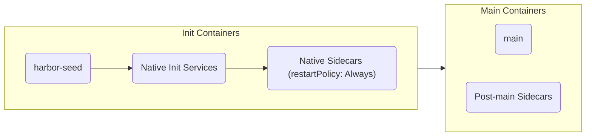
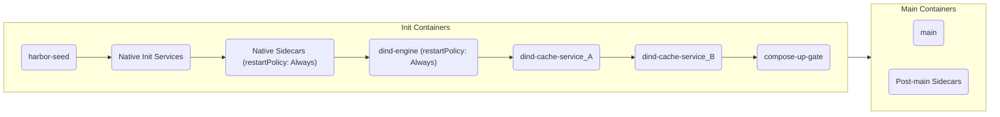
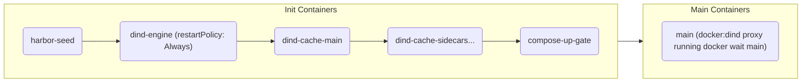

# Compose translation

This document provides the authoritative reference for how a Docker Compose file becomes a Kubernetes Pod.

## The problem and design goal

Docker Compose and Kubernetes Pods represent workloads using fundamentally different semantics. Compose operates on a loose collection of interconnected containers with distinct lifecycles, full network isolation controls, and host-bound volumes. A Kubernetes Pod strictly binds a group of containers to a shared network namespace, a shared lifecycle, and a shared set of ephemeral or persistent volumes.

The design goal of the `harbor-gke-ext` translator is to achieve behavioral parity with `docker compose up`. Rather than forcing users to rewrite their tasks into native Kubernetes manifests, the environment translates standard Compose projects into a single, cohesive Pod that emulates the semantics of a local Docker host.

## The translation pipeline

The translation process follows a strict numbered sequence:

1. **Load and normalize**: The environment locates a compatible Docker Compose CLI binary, resolves all compose file paths, injects environment defaults, and delegates interpolation to `docker compose config --format json`.
2. **Classify placement**: A placement classifier inspects every parsed Compose service, its keys, and its declared values. It determines whether the service can run as a native Kubernetes container, or if it must be demoted to a Docker-in-Docker (DinD) plane.
3. **Select Pod shape**: Based on the classification, the translator chooses one of three Pod shapes (single-container, native Compose, or DinD Compose).
4. **Translate each service**: Service declarations (resources, volumes, probes, commands) are mapped into Kubernetes `V1Container` definitions.
5. **Emit the Job**: The assembled Pod spec is wrapped in a `batch/v1` Job and submitted to the cluster.

## Normalization

The translation pipeline offloads the complexity of Compose file parsing to the official `docker compose` CLI. The command `docker compose config --format json` is executed to resolve the project. 

Because `docker compose config` handles the front-end parsing, the environment naturally inherits standard Compose behaviors:
- **`extends` and profiles**: Fully expanded and resolved before the Harbor translator sees the payload.
- **`env_file` precedence**: Variable interpolation and `.env` file loading are resolved natively by the Compose CLI.
- **Merging**: Multiple `-f` files are merged correctly according to standard Compose rules.

Before invoking the CLI, the environment applies several defaults:
- **Base overlay**: The environment writes a temporary overlay file (`harbor-compose-base-*.yaml`) and passes it as the first `-f` file, before the task's `docker-compose.yaml`. The overlay always supplies `main.command: ["sh", "-c", "sleep infinity"]`, so tasks that declare only `main.image` keep `main` alive for the trial duration. When no Compose file declares `main.image` or `main.build`, the overlay also supplies `main.image: ${MAIN_IMAGE_NAME:-harbor-main:latest}`. If the task's own Compose file declares `main.command` or `main.entrypoint`, Compose merging overrides the base default.
- `CONTEXT_DIR` resolves to the absolute host path of the environment directory.
- `CPUS` defaults to `1` and `MEMORY` defaults to `2048M` to satisfy parser constraints on resource strings.
- From `os.environ`, only system keys (`PATH`, `HOME`, ...) and the host variables the Compose files reference are passed, as in Harbor's Modal environment; task env, persistent env and Harbor's infra variables override them, and `DOCKER_HOST` always points at a nonexistent socket. See [Networking and security](networking-and-security.md).

## Placement classifier

The placement classifier (`placement.py`) implements a two-tier model across all parsed services and keys to choose between **Shape A** (all services native), **Shape B** (native `main` + DinD sidecars), and **Shape C** (`main` and every other Compose service in DinD):

- **Tier 1 (Fatal)**: Features that cannot be supported natively or inside the DinD plane. These raise an `UnsupportedComposeFeatureError` and fail the task immediately.
- **Tier 2 (DinD Demotion)**: Features that Kubernetes does not support natively on a Pod container, but that an isolated inner `dockerd` (`dind-engine`) can execute.
  - When **only sidecars** accumulate DinD reasons and `main` has none, the classifier selects **Shape B (Hybrid)**: `main` runs natively as the primary Pod container while the demoted sidecars run inside `dind-engine`.
  - When **`main` itself** accumulates one or more DinD reasons, the classifier selects **Shape C (Main-in-DinD)**. The reasons that can apply to `main` are `privileged: true`, a `/var/run/docker.sock` mount, non-GPU `devices`, unsafe `sysctls`, a mounted external volume (or an unmounted external volume when `main` is the only service), and any `DIND_KEYS` field such as `ulimits`. In Shape C, `main` and every other Compose service (including one-shot services) run inside `dind-engine` with bare `<service>` container names (for example, `main`). Sibling services without their own DinD reasons receive `CO_LOCATED_WITH_MAIN_DIND`.

`build:`, `cap_add`, `security_opt`, `network_mode`, `read_only`, `command`, and `entrypoint` are in `NATIVE_KEYS` and do not select Shape C. A `cap_add` capability outside the Pod Security Standards Baseline set does not demote a service to DinD; it marks the Pod for gVisor instead (see [Feature translation fidelity](#feature-translation-fidelity)).

The translator records the placement outcome on these Pod annotations:
- `harbor.dev/compose-placement`: `"native"` (Shape A) or `"dind"` (Shapes B and C)
- `harbor.dev/compose-placement-shape`: `"A"`, `"B"`, or `"C"`
- `harbor.dev/compose-placement-summary`: a JSON object with the keys `shape`, `dind_reasons` (service name to reason codes), `warnings`, and `streaming`
- `harbor.dev/dind-delegated-services`: a sorted JSON array of the services that run inside `dind-engine` (set only when that list is non-empty)

### Tier 1: Fatal reason codes

| Code | Trigger | Why it fails |
|---|---|---|
| `MAC_ADDRESS` | `mac_address` key | Kubernetes does not support assigning arbitrary MAC addresses to containers. |
| `WINDOWS_ONLY` | `credential_spec`, `isolation` | Windows containers are not supported by the environment. |
| `EXTERNAL_LINKS` | `external_links` key | Links outside the compose project cannot be resolved. |
| `CGROUP` | `cgroup` (any value), `cgroup_parent` | Arbitrary cgroup hierarchies are managed exclusively by the kubelet. |
| `PROVIDER` | `provider` key | Cloud provider integrations in Compose are unsupported. |
| `HOST_NAMESPACE` | `userns_mode`, `uts`, `pid: host`, `ipc: host` | Host user/UTS/PID/IPC namespace sharing violates the sandbox boundaries and is rejected (`userns_mode` and `uts` are in `ALWAYS_UNSUPPORTED`; `pid: host` and `ipc: host` raise `HOST_NAMESPACE`). |
| `SCALE_GT1` | `scale > 1`, `deploy.replicas > 1` | A Pod cannot dynamically scale individual containers inside itself. |
| `NETWORK_MODE_HOST` | `network_mode: host` | Host network mode is prohibited by security policies. |
| `NETWORK_MODE_NONE` | `network_mode: none` on any service, including `main` | Kubernetes requires all native containers in a Pod to share the Pod network namespace. |
| `STOP_SIGNAL` | Invalid `stop_signal` | Only `SIGTERM`, `SIGKILL`, `15`, or `9` are allowed. |
| `STATIC_IP` | Static IP assignment (`ipv4_address` / `ipv6_address`) | Pod IPs are assigned dynamically by the cluster CNI. |
| `ABSOLUTE_BIND` | Bind mount source escapes task/base dir | Prevents host filesystem access outside the designated sandbox directories. A `/var/run/docker.sock` mount is excluded (it produces `DOCKER_SOCK`), and so are Harbor log paths (`/logs`, `/logs/*` sources, and `/logs`, `/logs/verifier`, `/logs/agent`, `/logs/artifacts` targets). Other socket paths, such as `/run/docker.sock`, are checked like any other bind source. |
| `VOLUME_DRIVER` | Top-level volume with a `driver` other than `local` | Only the default `local` driver is mapped to Pod volumes. `driver_opts` is not inspected. |
| `EXTERNAL_CONFIGS` | `configs.*.external` | External Swarm/Compose configs are not present in the Kubernetes cluster. |
| `EXTERNAL_SECRETS` | `secrets.*.external` | External Swarm/Compose secrets are not present in the Kubernetes cluster. |
| `MAIN_NETWORK_SEGMENTATION` | Sidecar cannot reach `main` (`len(top_nets) > 1`) | When multiple top-level networks exist and a sidecar shares no network with `main`, native Pod sharing would violate network segmentation. |
| `MISSING_MAIN_SERVICE` | No `main` service | The environment strictly requires a service named `main`. |
| `DEPENDENCY_CYCLE` | Cycle in pre-main candidates | Topological sorting of init containers is impossible. |
| `MAIN_NEEDS_DIND:<reason>` | Override `native` when `main` has DinD reasons | The user forced `compose_placement=native`, but `main` requires DinD features. |
| `NATIVE_PLACEMENT_REJECTED` | Override `native` when a sidecar has DinD reasons | The user forced `compose_placement=native`, but a sidecar requires DinD (`NATIVE_PLACEMENT_REJECTED:<service>:<reasons>`). |
| `AUTOPILOT_<enum.name>` | DinD plane on unsupported Autopilot cluster | Emits `AUTOPILOT_DIND_UNAVAILABLE` when DinD is required (`Shape B` or `Shape C`) on an Autopilot cluster without privileged DinD admission. |
| `UNCLASSIFIED_KEY` | Unknown or unrecognized service key | Unrecognized Compose service keys fail placement immediately and log the offending key (`UNCLASSIFIED_KEY:<service>:<key>`). |
| `GPU_COMPOSE_ONLY` | `count: all` without `gpus` or `default_gpu_count` | A service requested all GPUs, but neither `task.toml` nor `--ek default_gpu_count` allocates any. |
| `GPU_COUNT_MISMATCH` | Compose GPU counts conflict with task config | `main` declares an integer GPU count where `main + sidecars != toml_gpus`, or `toml_gpus < sidecar_gpu_sum`. |
| `GPU_TYPE_UNRESOLVED` | GPUs requested without a type | A GPU type must be specified via `gpu_types`, `gpu_override`, or `default_gpu_type`. |
| `ValueError` / `RuntimeError` | Invalid `gpu_override` label | The provided GPU override is not a valid GKE accelerator label (must be a full GKE label such as `nvidia-l4`, not a bare shorthand). |

### Tier 2: DinD demotion reason codes (route to Shape B for sidecars, or Shape C when on `main`)

| Code | Trigger | Why it demotes to DinD |
|---|---|---|
| `PRIVILEGED` | `privileged: true` | Privileged containers run inside `dind-engine` to isolate elevated access or allow nested container operations. |
| `DOCKER_SOCK` | A volume whose source or target is `/var/run/docker.sock` | The node's Docker socket is not available to Pods; the service needs the isolated `dind-engine` daemon. On `main`, this selects Shape C. |
| `DEVICE_NON_GPU` | Non-GPU entry in `devices` | Direct non-GPU device mapping (excluding `/dev/nvidia*` and `/dev/dri*`) bypasses standard Kubernetes device plugins. |
| `UNSAFE_SYSCTL` | Sysctl outside `SAFE_SYSCTL_PREFIXES` | Kubernetes restricts sysctls outside the safe subset (`kernel.shm*`, `kernel.msg*`, `kernel.sem`, `fs.mqueue.*`, and safe `net.ipv4.*` keys). |
| `USER_BY_NAME` | Non-numeric `user` (not `root` or `0`) on a sidecar | Kubelet requires numeric UIDs for `runAsUser`; resolving named users on sidecars requires the image's `/etc/passwd` via Docker. |
| `ULIMITS` | `ulimits` | Kubernetes does not support per-container ulimits natively. |
| `INIT_PID1` | `init` | Kubelet does not inject `tini` or a custom PID 1 init process. |
| `BLKIO` | `blkio_config` | Kubernetes does not expose block I/O throttling limits at the container level. |
| `CPUSET` | `cpuset` | CPU pinning is managed by the kubelet's CPU manager policy, not per-container requests. |
| `CPU_LEGACY` | Legacy CPU fields (`cpu_count`, `cpu_percent`, `cpu_period`, `cpu_quota`, `cpu_rt_runtime`, `cpu_rt_period`) | Legacy Docker CPU scheduler parameters require `dockerd`. `cpu_shares` is not in `DIND_KEYS` or `NATIVE_KEYS`, so it fails with `UNCLASSIFIED_KEY`. |
| `OOM` | `oom_kill_disable`, `oom_score_adj` | OOM scores are managed by the kubelet based on QoS classes. |
| `SWAP` | `mem_swappiness`, `memswap_limit` | Swap configuration is disabled or strictly managed on Kubernetes nodes. |
| `PIDS_LIMIT` | `pids_limit` | Per-container process ID limits require Docker daemon enforcement. |
| `STORAGE_OPT` | `storage_opt` | Storage options are specific to Docker graph drivers. |
| `DEVICE_CGROUP` | `device_cgroup_rules` | Custom cgroup device rules are unsupported by standard Pod specs. |
| `EXTERNAL_VOLUME` | A service mounts a top-level `external: true` volume, or an external volume is declared but not mounted (every sidecar is tagged, or `main` when it is the only service) | External named volumes rely on Docker's local volume management. |
| `MULTI_NETWORK` | Sidecar on >1 network when `len(top_nets) > 1` | Multi-network attachment on sidecars relies on Docker bridge routing. |
| `PORT_COLLISION` | The same container port (from `expose`, or the target side of `ports`) is declared by more than one service | Kubernetes Pods share one network namespace, so the ports collide. Only the non-`main` owners are demoted. |
| `EXPLICIT_PLACEMENT_DIND` | Mode override `dind` (`compose_placement=dind`; or `enable_dind=true` / `compose_mode=dind` when `compose_placement` is not set) | The user explicitly requested DinD placement for sidecars. |
| `CO_LOCATED_WITH_MAIN_DIND` | Sibling service in Shape C without own DinD triggers | Co-located into `dind-engine` when `main` runs in DinD so all services share the inner Compose network and volumes. |

## Pod shapes

The translation process selects one of three Pod shapes (`Shape A`, `Shape B`, or `Shape C`) based on the task configuration and the classification results. All trials run as a `batch/v1` Job wrapping exactly one Pod with `restartPolicy: Never` and the annotation `cluster-autoscaler.kubernetes.io/safe-to-evict: "false"`.

### Shape A: Native Pod (single-container or native Compose)

Used for single-container tasks (no `docker-compose.yaml`, producing a single `main` container and no `initContainers`) and for Compose tasks where every service can run natively on Kubernetes (`harbor.dev/compose-placement-shape: "A"`).

**Execution Order (Compose Shape A):**
1. **`harbor-seed`** (`restartPolicy: None`): Extracts bind mounts if any exist. Runs the main image.
2. **Native Init Services** (`restartPolicy: None`): Topologically sorted services targeted by `condition: service_completed_successfully`.
3. **Native Sidecars** (`restartPolicy: Always`): Topologically sorted long-running sidecars, utilizing KEP-753 native sidecar support.
4. **`main`**: The primary task sandbox container.
5. **Post-main Sidecars**: Services declaring `depends_on: main`. These containers are injected with a shell wrapper that blocks execution until a gate file is written by the orchestrator signaling `main` is ready.

### Shape B: Hybrid DinD (`main` native + DinD sidecars)

Used when `main` can run natively, while at least one sidecar accumulates a DinD demotion reason code (`harbor.dev/compose-placement-shape: "B"`).

**Execution Order (Shape B):**
1. **`harbor-seed`** (`restartPolicy: None`): Extracts bind-mount archives into shared Pod volumes. The archive is inlined as base64 when the payload is under 512 KiB, the base64 data is at most 64 KiB (`_SEED_INLINE_MAX_B64_BYTES`), and the script fits within `MAX_ARG_STRLEN`; otherwise the orchestrator streams it.
2. **Native Init Services** (`restartPolicy: None`): One-shot setup services.
3. **Native Sidecars** (`restartPolicy: Always`): Native long-running sidecars.
4. **`dind-engine`** (`restartPolicy: Always`): Before it execs `dockerd`, it copies the Docker CLI to `/harbor/dind-images/docker-cli`, creates host-path volume symlinks (`ln -sfn`), and writes `/harbor/dind-images/.docker/config.json` with the node service account's Google OAuth2 bearer token for `gcr.io`, `us-docker.pkg.dev`, and any `*.gcr.io` or `*.pkg.dev` host that appears in a DinD service image. A background loop refreshes the token every 900 seconds. It then execs the isolated inner `dockerd` on `unix:///var/run/harbor-dind/docker.sock` with `/var/lib/docker` mounted from `harbor-dind-storage` (an ext4 disk-backed `emptyDir`, or a generic ephemeral volume PVC when `scratch_volume_size` is set), where `dockerd` auto-selects `overlay2` so image layers consume ephemeral disk rather than RAM. Its `startupProbe` gates downstream initContainers until `docker info` succeeds.
5. **`dind-cache-<service>`** (`restartPolicy: None`): One initContainer per DinD-delegated sidecar (in `sorted()` order). If the image is already present in `dind-engine`, the step exits. Otherwise it pulls the image with `DOCKER_CONFIG=/harbor/dind-images/.docker /harbor/dind-images/docker-cli pull -q "$IMG"`, which preserves OCI metadata and hardlinks, and falls back to `tar -cf - / | docker-cli import --change ...` if the pull fails (for example, local-only tags or external registries blocked by the Pod's `NetworkPolicy`, which is applied before Job creation).
6. **`compose-up-gate`** (`restartPolicy: None`): Verifies all required images are present in `dind-engine`, writes `/harbor/dind-compose.yaml` (with each service's `container_name` set to its bare `<service>` name), and executes `docker compose up -d --wait --pull never`.
7. **`main`**: The primary task sandbox container (running natively in the Pod).
8. **Post-main Sidecars**: Services declaring `depends_on: main`.

> [!NOTE]
> `dind-engine` is **not** the first initContainer. Shape B seamlessly mixes native sidecars and DinD sidecars: only services with DinD reasons are delegated to `dind-engine` and listed in `harbor.dev/dind-delegated-services`.

### Shape C: Main-in-DinD (`main` and all sidecars inside `dind-engine`)

Used when `main` itself accumulates one or more DinD demotion reason codes (`harbor.dev/compose-placement-shape: "C"`).

**Execution Order and Routing (Shape C):**
1. **`harbor-seed`** (`restartPolicy: None`): Extracts bind-mount archives into shared Pod volumes.
2. **`dind-engine`** (`restartPolicy: Always`): Stages the Docker CLI and Google registry OAuth2 config into `/harbor/dind-images`, creates host-path volume symlinks (`ln -sfn` from task host paths to `/harbor/pod-vols/<vol_name>`), and starts `dockerd` on `unix:///var/run/harbor-dind/docker.sock` backed by `harbor-dind-storage` (`/var/lib/docker`, `overlay2` on disk). A one-shot background waiter mounts `main`'s **image** layers read-only at `/tmp/harbor-main-rootfs` and symlinks `/app` to it, so nested `docker run -v /app/...` commands inside `dind-engine` resolve against the files in `main`'s image. Files that the running `main` container writes are not visible through this mount.
3. **`dind-cache-main` & `dind-cache-<service>`** (`restartPolicy: None`): Pulls `main`'s image and every delegated sidecar image into `dind-engine` via `docker pull` (with `tar -cf - / | docker import --change ...` as automatic fallback).
4. **`compose-up-gate`** (`restartPolicy: None`): Starts the entire Compose project (including `main`, with `container_name: main`) inside `dind-engine` via `docker compose up -d --wait --pull never`, then waits for `/tmp/env-ready` inside `main` if `/app/entrypoint.sh` references it. If `docker compose up` fails, it dumps `docker compose logs --tail=100` to stderr.
5. **Kubernetes `main` container**: Runs a lightweight `docker:28.3.3-dind` CLI proxy container (`DOCKER_HOST=unix:///var/run/harbor-dind/docker.sock`) that executes `rc=$(docker wait main 2>/dev/null || echo 1); exit ${rc:-1}` to bind the Pod lifetime to the inner `main` container.
6. **Transparent `dind_services` exec routing**: Because `main` (and all delegated sidecars) are listed in `harbor.dev/dind-delegated-services` (`GKEEnvironment._dind_services`), `connect_exec_stream()` in `exec_engine.py` opens the Kubernetes exec stream to the Pod's `main` container and wraps every `exec`, `upload_file`, `upload_dir`, `download_file`, and `download_dir` call targeting a service in `dind_services` as `docker exec [-i] [-t] <service> <command>` (e.g., `docker exec -i main ...`). Per-service operations in `ComposeServiceOpsMixin` (`service_exec`, `service_download_file`, `service_download_dir`, and `stop_service`) run against `dind-engine`. Downloads are staged with `docker cp`, and `stop_service` runs `docker kill --signal=STOP`. There are no per-service upload methods.

## Feature translation fidelity

| Compose key | Kubernetes construct | Notes and limitations |
|---|---|---|
| `entrypoint` / `command` | `command` / `args` | A string `command` without an entrypoint becomes `["/bin/sh", "-c", <cmd>]`. For `main`, the generated base overlay provides `["sh", "-c", "sleep infinity"]` whenever the task's Compose file omits both `command` and `entrypoint`. |
| `healthcheck` | `startupProbe` / `readinessProbe` | Translated to `exec` probes. Native sidecars (`restartPolicy: Always`) receive a `startupProbe`; `main` and post-main sidecars receive a `readinessProbe`. One-shot init containers (`restart=no` + `service_completed_successfully`) drop `readinessProbe` and log a warning because Kubernetes rejects readiness probes on non-sidecar initContainers. |
| `depends_on` | InitContainer ordering / Gates | `service_completed_successfully` forces a service into a one-shot init container. `depends_on: main` routes a sidecar to the post-main containers block and injects a blocking wait wrapper. |
| `volumes` (named/anonymous) | `emptyDir` / `ephemeral` | Named volumes use `emptyDir` by default, or Kubernetes generic ephemeral volumes (`ephemeral.volumeClaimTemplate`) when `--ek scratch_volume_size=<size>` is configured. Anonymous volumes are masked properly if they fall under bind mounts. |
| `volumes` (bind) | `emptyDir` (Seeded) | Binds are staged into an `emptyDir` by the `harbor-seed` container. Depending on payload size, files are either base64 inlined or streamed by the orchestrator. Host paths outside the workspace are rejected. |
| `tmpfs` | `emptyDir` (Memory medium) | Becomes an `emptyDir` with `medium: Memory` for every natively placed service, including `main`. On GKE Autopilot, `medium: ""` is used because Autopilot does not admit `medium: Memory`, and `size=` values are capped at 10,240 MiB. In DinD mode (`compose-up-gate`), inner `tmpfs` entries are deduplicated against existing volume mounts, assigned an explicit `size=` parameter (default 64 MiB), and capped at the task memory budget or the service's own `mem_limit`, whichever is lower. |
| `deploy.resources` | Requests and limits | Passed through verbatim to the container. Nothing is synthesized: a service that declares nothing gets nothing. The task budget replaces whatever `main` declares. In every shape, an undeclared service is bounded only by the Pod ceiling on `spec.resources`, as an unconstrained container is bounded by its Docker host (see [Docker-in-Docker](docker-in-docker.md#resource-model-and-volume-topology)). An unparseable value is dropped with a warning rather than replaced by a default. See [The task-wide resource model](configuration.md#the-task-wide-resource-model). |
| `expose` / `ports` | `containerPorts` | `expose` generates container ports. Published `ports` are ignored for translation and only used to detect unresolvable port collisions natively. |
| `networks` | None (placement input only) | No `NetworkPolicy` is derived from Compose networks. Placement uses them to detect a sidecar that shares no network with `main` (`MAIN_NETWORK_SEGMENTATION`, fatal) or a sidecar on several networks (`MULTI_NETWORK`, DinD demotion). Native containers share a single network namespace. Inside DinD, declared networks are kept and every service is also attached to `harbor_dind_net`. |
| `hostAliases` / `extra_hosts` | `hostAliases` | Generates `/etc/hosts` entries. DinD service hostnames are mapped to their bridge IP. `host-gateway` entries are silently dropped. |
| `environment` | `env` | Native sidecars receive only their declared environment variables. `startup_env` applies only to `main`. |
| `working_dir` | `workingDir` | Falls back to `main_workdir` for `main` only. |
| `user` | `securityContext.runAsUser` | Must be numeric or `root` for native Kubernetes translation. Named users force the sidecar into the DinD plane. |
| `cap_add` / `cap_drop` | `securityContext.capabilities` | A capability outside the Pod Security Standards Baseline set logs a warning and marks the Pod as needing gVisor. Harbor records these on the `harbor.dev/gvisor-capabilities` annotation, and on Autopilot Shape A Pods without an explicit runtime class it sets `runtimeClassName: gvisor`. `cap_add` never demotes a service to DinD. |
| `security_opt` | None | Listed in `NATIVE_KEYS`, so it passes placement, but it is not translated: no `seccompProfile` or `appArmorProfile` is set. |

## Known limitations

- **Host Namespace & Privileged Modes**: True host network, PID, or IPC namespaces are rejected natively for security. Privileged containers run exclusively in the DinD plane.
- **One-shot Init Container Probes**: Kubernetes does not admit `readinessProbe` on non-sidecar init containers (`restartPolicy: None`). If a one-shot init service declares a `healthcheck`, the translator drops the probe and logs a warning; exit code 0 of the init container gates downstream containers instead.
- **Volume Semantics**: There are no hostPath volumes. Volumes are bound to the Pod's lifecycle (`emptyDir` by default, or per-Pod GCE Persistent Disks via generic ephemeral volumes when `--ek scratch_volume_size=<size>` is set).
- **Autopilot Constraints**: `tmpfs` uses node ephemeral storage rather than RAM. Whether limits are forced to equal requests is decided by Autopilot's own admission webhook, not by Harbor.
- **Single Network Namespace**: All native sidecars and `main` share `localhost`. Compose networks are not replicated in Shape A; colliding ports trigger DinD demotion instead of isolated networking.

## Related documentation

- [Configuration reference](configuration.md)
- [Architecture](architecture.md)
- [Docker-in-Docker](docker-in-docker.md)
- [Networking and security](networking-and-security.md)
- [Accelerators](accelerators.md)
- [Troubleshooting](troubleshooting.md)
- [Design decisions](design-decisions.md)
