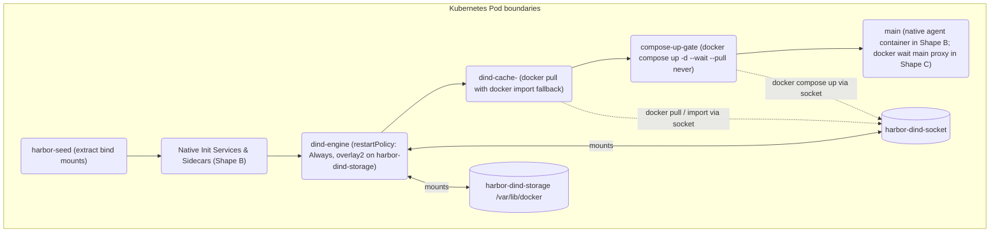

# Docker-in-Docker

The `harbor-gke-ext` environment provides a fallback Docker-in-Docker (DinD) execution plane to support Docker Compose features that lack native Kubernetes equivalents.

The DinD plane is a **fallback, not the default**. Most Compose files translate into native Kubernetes sidecars (Shape A). The DinD plane is constructed only when a service utilizes an incompatible feature—such as non-numeric users, Docker sockets, or device cgroup rules—or when port collisions occur within the Pod's shared network namespace.

## Two DinD Pod shapes: Shape B (Hybrid) and Shape C (Main-in-DinD)

When the placement classifier (`placement.py`) detects Compose features that Kubernetes cannot execute natively, it selects one of two DinD shapes depending on whether `main` itself needs Docker:

| Shape | What runs in `dind-engine` | What runs as a native Pod container | Typical use case |
| --- | --- | --- | --- |
| **Shape B — Hybrid DinD** (`harbor.dev/compose-placement-shape: "B"`) | Only the sidecars that accumulated DinD reason codes (`harbor.dev/dind-delegated-services`). | `main`, plus any native sidecars. | Multi-container tasks where two sidecars collide on a port, a sidecar uses a named user, or a sidecar is attached to multiple networks (one of which `main` shares), while `main` is a standard agent container. |
| **Shape C — Main-in-DinD** (`harbor.dev/compose-placement-shape: "C"`) | **`main` (container name `main`) and every other Compose service, including one-shot services.** | A lightweight Kubernetes `main` CLI proxy (`docker:28.3.3-dind` running `docker wait main`) that ties the Pod lifetime to the inner `main` container. | Tasks where `main` declares `privileged: true`, mounts `/var/run/docker.sock`, maps non-GPU `devices`, sets unsafe `sysctls`, mounts an external volume, or uses a `DIND_KEYS` field such as `ulimits`. `build:`, `cap_add`, `security_opt`, `network_mode`, `read_only`, and `docker` commands in `command` or `entrypoint` do not select Shape C. |

In both shapes, the set of services running inside `dind-engine` is recorded at Pod-spec creation time on the annotation `harbor.dev/dind-delegated-services` (a sorted JSON array of service names) and stored on `GKEEnvironment._dind_services` (`frozenset[str]`).

## Container roster and init sequence

In Shape B and Shape C, the translator builds an ordered sequence of `initContainers` before the Pod's `main` container starts:



1. **`harbor-seed`** (`restartPolicy: None`): Extracts task bind-mount archives into shared Pod volumes. The archive is inlined as base64 when the payload is under 512 KiB, the base64 data is at most 64 KiB (`_SEED_INLINE_MAX_B64_BYTES`), and the script fits within `MAX_ARG_STRLEN`. Otherwise the orchestrator streams the archive and then creates `/harbor/compose-binds/.seed-ready`, which `harbor-seed` waits for.
2. **`dind-engine`** (`DIND_ENGINE_CONTAINER`, `restartPolicy: Always`): Runs `docker:28.3.3-dind`. Before it execs `dockerd`, it copies the static Docker CLI to `/harbor/dind-images/docker-cli` (no Compose plugin is staged; `compose-up-gate` uses the `docker compose` bundled in its own `docker:dind` image), creates host-path volume symlinks (`ln -sfn` from original task paths to `/harbor/pod-vols/<vol_name>`), and writes `/harbor/dind-images/.docker/config.json` with the node service account's Google OAuth2 bearer token for Google registries only (`gcr.io`, `us-docker.pkg.dev`, and any `*.gcr.io` or `*.pkg.dev` host that appears in a DinD service image). A background loop refreshes the token every 900 seconds. A one-shot background waiter mounts `main`'s image layers read-only at `/tmp/harbor-main-rootfs` (and symlinks `/app`) once `compose-up-gate` records them; this happens only in Shape C. `dockerd` then starts with `/var/lib/docker` mounted from `harbor-dind-storage` (an ext4 disk-backed `emptyDir`, or a generic ephemeral volume PVC when `scratch_volume_size` is set), where it auto-selects `overlay2`, and exposes the daemon socket on `unix:///var/run/harbor-dind/docker.sock`. Its `startupProbe` gates downstream initContainers until `docker info` succeeds.
3. **`dind-cache-<service>`** (`DIND_CACHE_CONTAINER_PREFIX`, `restartPolicy: None`): One initContainer per service in `dind_services` (including `dind-cache-main` in Shape C), in `sorted()` order. If the image is already present in `dind-engine`, the step exits. Otherwise it pulls the image with `DOCKER_CONFIG=/harbor/dind-images/.docker DOCKER_HOST=unix:///var/run/harbor-dind/docker.sock /harbor/dind-images/docker-cli pull -q "$IMG"`, and falls back to `tar -cf - --exclude=/proc --exclude=/sys --exclude=/dev --exclude=/harbor --exclude=/var/run --exclude=/run --exclude=/etc/hosts --exclude=/etc/resolv.conf --exclude=/etc/hostname / | docker-cli import --change ... - "$IMG"` if the pull fails.
4. **`compose-up-gate`** (`COMPOSE_UP_GATE_CONTAINER`, `restartPolicy: None`): Verifies all required images exist in `dind-engine`, writes the translated inner Compose file (`/harbor/dind-compose.yaml`, plus `/harbor/dind-compose.gpu.yaml` when a DinD service requests GPUs), and runs `docker compose up -d --wait --pull never`. In Shape C it then waits for `/tmp/env-ready` inside `main` if `/app/entrypoint.sh` references it. If `docker compose up` fails, it dumps `docker compose logs --tail=100` to stderr.
5. **Kubernetes `main` container**: In Shape B, runs the task's native `main` container unmodified; Harbor does not add the DinD CLI to its `PATH` or set `DOCKER_HOST`. In Shape C, runs a lightweight `docker:28.3.3-dind` proxy container with `DOCKER_HOST=unix:///var/run/harbor-dind/docker.sock` whose command is `rc=$(docker wait main 2>/dev/null || echo 1); exit ${rc:-1}`.

## The inner Compose file

To run the delegated services, `compose-up-gate` writes the translated inner `docker-compose.yaml` (`/harbor/dind-compose.yaml`, and optionally `/harbor/dind-compose.gpu.yaml`) before executing `docker compose up`:

- **Networks**: Each DinD service keeps its declared networks and is also attached to a synthesized bridge network, `harbor_dind_net` (the first free `/24` in `172.30.240.0/24`–`172.30.254.0/24`), with a deterministic static IP. Top-level network definitions are preserved. `main`'s hostnames are mapped to that network's gateway through `extra_hosts`. A service with `network_mode: service:<name>` shares its target's network and is not attached separately.
- **Volumes**: Pod volume mounts become bind mounts under `/harbor/pod-vols/<vol_name>`. A `/var/run/docker.sock` mount translates to `/var/run/harbor-dind/docker.sock:/var/run/docker.sock` so nested `docker` commands inside `main` or a sidecar talk to `dind-engine`. Placement rejects a `/run/docker.sock` bind with `ABSOLUTE_BIND`.
- **`depends_on`**: Filtered to services residing within the DinD plane.
- **Build contexts**: Stripped (`build:` removed) and replaced with the pre-built Artifact Registry `image:` URL.
- **Container names**: Assigned deterministically as the bare service name (`container_name: <service>`, e.g. `main`) so `exec_engine.py` and `ComposeServiceOpsMixin` can target them reliably.
- **GPU library and device mappings**: Compose `deploy.resources.reservations.devices` blocks are stripped from `/harbor/dind-compose.yaml`. When GPUs are requested, the service entry receives a `/usr/local/nvidia:/usr/local/nvidia:ro` bind mount and merged `LD_LIBRARY_PATH`, while `compose-up-gate` generates `/harbor/dind-compose.gpu.yaml` mapping the discovered `/dev/nvidia*` devices into the nested container.

## Image materialization (`docker pull` with `docker import` fallback)

Each `dind-cache-<service>` initContainer populates `dind-engine`'s disk-backed `/var/lib/docker` (`harbor-dind-storage`, `overlay2`) using a two-path strategy:

1. **Primary path (`docker pull`)**: `dind-engine` fetches an OAuth2 access token from the metadata server (`http://169.254.169.254/computeMetadata/v1/instance/service-accounts/default/token`) and writes `/harbor/dind-images/.docker/config.json` with bearer-token auth for Google registries only: `gcr.io`, `us-docker.pkg.dev`, and any `*.gcr.io` or `*.pkg.dev` host that appears in a DinD service image. Each entry names an explicit host; there are no wildcard entries. Each `dind-cache-<service>` initContainer first checks whether the image is already present in `dind-engine` and exits if it is. Otherwise it runs `DOCKER_CONFIG=/harbor/dind-images/.docker DOCKER_HOST=unix:///var/run/harbor-dind/docker.sock /harbor/dind-images/docker-cli pull -q "$IMG"`.
2. **Automatic fallback (`docker import`)**: If `docker pull` fails (for example, local-only image tags, external registries blocked by the Pod's `NetworkPolicy`, or missing Artifact Registry IAM permissions on the Pod's Workload Identity principal), `dind-cache-<service>` falls back to streaming its own root filesystem into `dind-engine` via `tar -cf - --exclude=/proc --exclude=/sys --exclude=/dev --exclude=/harbor --exclude=/var/run --exclude=/run --exclude=/etc/hosts --exclude=/etc/resolv.conf --exclude=/etc/hostname / | docker-cli import --change ... - "$IMG"`. The `--change` flags reconstruct `ENTRYPOINT`, `CMD`, `EXPOSE`, `LABEL`, `STOPSIGNAL`, and `HEALTHCHECK` from the image's OCI config, plus `WORKDIR`, `ENV` (excluding Kubernetes and shell variables such as `KUBERNETES_*`, `HOSTNAME`, and `HOME`), and `USER` (only when the container does not run as UID 0).
3. **Why `docker pull` is the primary path**: On GKE nodes with Image Streaming (`gcfs`), the overlay mount reports `st_nlink = 1` for every inode. When `tar -cf - /` runs over a `gcfs` rootfs, it cannot detect hardlinks and serializes every hardlinked path as an independent copy—for example, an image containing 1,623 hardlinked database snapshots inflates from ~25.6 GiB compressed to ~301 GiB in `/var/lib/docker/overlay2` and can take 45+ minutes to import. `docker pull` downloads the compressed layer tarballs directly from Artifact Registry and unpacks them inside `dind-engine`'s `overlay2` graph driver in seconds, preserving hardlinks and retaining exact OCI image metadata without `--change` reconstruction.

> [!IMPORTANT]
> **Required IAM binding for private Artifact Registry repositories when Workload Identity is enabled:**
> On GKE clusters with Workload Identity Federation enabled (`--workload-pool="${PROJECT_ID}.svc.id.goog"` on Standard, or by default on Autopilot), `gke-metadata-server` intercepts Pod requests to `169.254.169.254` and returns a token for the **Pod's Workload Identity principal** (`principal://iam.googleapis.com/projects/${PROJECT_NUMBER}/locations/global/workloadIdentityPools/${PROJECT_ID}.svc.id.goog/subject/ns/<namespace>/sa/<ksa>`), **not** the node's Compute Engine service account (`NODE_SA`).
>
> To ensure `docker pull` inside `dind-cache-<service>` succeeds against your Artifact Registry repository (`harbor-tasks`) instead of failing with `Permission 'artifactregistry.repositories.downloadArtifacts' denied` and falling back to `docker import`, you must:
> 1. First create the cluster with `--workload-pool="${PROJECT_ID}.svc.id.goog"` (or create an Autopilot cluster) so the `workloadIdentityPools/${PROJECT_ID}.svc.id.goog` identity pool exists.
> 2. Grant `roles/artifactregistry.reader` on the `harbor-tasks` repository to that Workload Identity pool:
> ```bash
> PROJECT_NUMBER=$(gcloud projects describe "${PROJECT_ID}" --format="value(projectNumber)")
> gcloud artifacts repositories add-iam-policy-binding harbor-tasks \
>   --location="${REGION}" \
>   --project="${PROJECT_ID}" \
>   --member="principalSet://iam.googleapis.com/projects/${PROJECT_NUMBER}/locations/global/workloadIdentityPools/${PROJECT_ID}.svc.id.goog/*" \
>   --role="roles/artifactregistry.reader"
> ```
> See [Cluster setup](cluster-setup.md) and [Troubleshooting](troubleshooting.md) for details.

## Memory floor and volume topology

- **Pod memory-limit floor (`DIND_POD_MEMORY_LIMIT_FLOOR_MB = 8192`)**: In DinD shapes, `/var/lib/docker` is backed by disk (`harbor-dind-storage`), so unpacked image layers consume ephemeral disk (`ephemeral-storage`), not RAM. However, `dind-engine` (`dockerd` + `containerd`), `docker compose`, and all nested inner containers (`postgres`, `redis`, `nginx`, or inner `docker compose up` stacks) share the Pod's memory cgroup. Whenever DinD is active and the Pod carries a memory budget (a declared task memory or a non-zero container aggregate), `build_pod_level_resources()` raises `spec.resources.limits.memory` to at least `8192Mi` while keeping `spec.resources.requests.memory` at the task's declared request.
- **Ephemeral storage sizing (`DIND_IMAGE_EXPANSION_RATIO = 3.0`, `DIND_STORAGE_FLOOR_MB = 10240`)**: When `dind-engine` is active, it requests `ephemeral-storage` equal to 3.0 × the sum of the compressed OCI layer sizes of the DinD service images, plus the task's storage budget, with a floor of `10240Mi` (10 GiB). This covers unpacked layers in `/var/lib/docker/overlay2`. The value is a request on `dind-engine` only, with no limit. Override it with `--ek dind_storage_mb=<MiB>` or per task with `--ek task_dind_storage_mb`.
- **Zero `hostPath` volumes**: Every volume is either a node `emptyDir` or, when `--ek scratch_volume_size=<size>` (e.g. `100Gi`) is set, a Kubernetes generic ephemeral volume (`ephemeral.volumeClaimTemplate`) backed by a per-Pod GCE Persistent Disk (`harbor-dind-storage` mounted at `/var/lib/docker`). With `scratch_volume_size`, `dind-engine` still requests the full `ephemeral-storage` estimate from the node, so the PD does not reduce the node reservation: the storage pre-check, the scheduler, and Autopilot `Performance` promotion account for `dind-engine` the same way as without it.

## Service transport (`dind_services` routing)

Remote execution and file transfers for DinD-delegated services (`GKEEnvironment._dind_services`) use two paths depending on the caller:

- **Primary trial execution and file transfers (`connect_exec_stream()` in `exec_engine.py`)**: When `env.exec()`, `upload_file()`, `upload_dir()`, `download_file()`, or `download_dir()` targets a container name in `dind_services` (such as `"main"` in Shape C), `connect_exec_stream()` opens the Kubernetes WebSocket exec stream against the Pod's `main` container and wraps the command in `docker exec [-i] [-t] <service> <command>` (targeting the bare `<service>` container name).
- **Per-service Compose operations (`ComposeServiceOpsMixin` / `_GKENativeComposeServiceTransport`)**: Helper methods that target named Compose services directly run against `dind-engine`. `service_exec()` runs `docker --host=unix:///var/run/harbor-dind/docker.sock exec [-w <workdir>] [-u <user>] [-e KEY=VAL ...] <service> sh -c ...`. `service_download_file()` and `service_download_dir()` copy out of `<service>` with `docker cp` into a staging path in `dind-engine`, download it, and remove the staging path. `stop_service()` freezes the service with `docker kill --signal=STOP`. There are no per-service upload methods.
- **Pod-rename immunity**: Because `GKEEnvironment._dind_services` is populated from the Pod spec annotation `harbor.dev/dind-delegated-services` before the Job creates the Pod, Job controller name suffixes and Spot preemption Pod replacements (`_reresolve_pod_name`) never disrupt DinD routing.

## Autopilot compatibility and capability probing

GKE Autopilot admits privileged containers only when a matching `WorkloadAllowlist` is installed on the cluster. Harbor's `dind-engine` is not a GKE partner workload, so it needs a customer-owned allowlist.

When evaluating cluster capabilities (`probe_cluster_via_gcloud()`, which calls `parse_gcloud_cluster_describe()` and `evaluate_autopilot_dind_capability()` in `cluster_probe.py`), the environment inspects the GKE cluster control-plane metadata (`autopilot.enabled`, `currentMasterVersion`, and `autopilot.privilegedAdmissionConfig.allowlistPaths`) and returns one of two `DindAvailability` states:

- `DIND_AVAILABLE`: All GKE Standard clusters, or GKE Autopilot clusters running version `>= 1.35` with at least one `allowlistPaths` entry configured under `autopilot.privilegedAdmissionConfig`.
- `DIND_UNAVAILABLE`: GKE Autopilot clusters running version `< 1.35`, Autopilot clusters without `allowlistPaths` configured, or Autopilot clusters whose control-plane metadata cannot be inspected.

If a task requires the DinD plane (`Shape B` or `Shape C`) and the probe returns `DIND_UNAVAILABLE`, the placement classifier raises a fatal `UnsupportedComposeFeatureError` with reason code `AUTOPILOT_DIND_UNAVAILABLE`.

> [!IMPORTANT]
> The `harbor-gke-ext` package **never** applies a cluster-wide `WorkloadAllowlist` itself—that is the cluster operator's responsibility. Customer-owned allowlists are available only to eligible Google Cloud customers. See [Enabling privileged DinD with a `WorkloadAllowlist`](autopilot.md#enabling-privileged-dind-with-a-workloadallowlist) for the procedure.

## Forcing and disabling the plane

You can control placement behavior via environment overrides (`--ek`):

- `--ek compose_placement=native`: Forces all services to run natively. If `main` requires DinD features, placement fails with `MAIN_NEEDS_DIND:<reason>`; if a sidecar requires DinD features, placement fails with `NATIVE_PLACEMENT_REJECTED:<service>:<reasons>`.
- `--ek compose_placement=dind`: Forces all sidecars into the DinD plane (`EXPLICIT_PLACEMENT_DIND`), regardless of whether they need it.
- `--ek enable_dind=true` or `--ek compose_mode=dind`: Legacy aliases for `compose_placement=dind`. They apply only when `compose_placement` is not set; an explicit `compose_placement` always wins. (`--ek compose_mode=native` is likewise a legacy alias for `compose_placement=native`.)

By default (`compose_placement=auto`), services are placed dynamically.

## Timeouts and failure modes

`compose_up_timeout_sec` (default `max(300, build_timeout_sec // 2)`) bounds `docker compose up` inside the **`compose-up-gate`** initContainer. On expiry the gate prints a `HARBOR_ERROR` line and exits 124.

A gate failure surfaces from the outside as an environment startup failure, because the orchestrator is blocked in `_wait_for_pod_ready`. To diagnose it, read the logs of the **`compose-up-gate`** initContainer, which contain the output of `docker compose up` and, on failure, `docker compose logs --tail=100`.

## Cost of the plane

Using the DinD plane introduces structural costs:
- **Additional image pulls**: The `dind-engine` (`docker:28.3.3-dind`) image must be pulled.
- **Cache containers**: One extra `dind-cache-<service>` initContainer is launched per delegated service.
- **Storage overhead**: `dind-engine` requires disk-backed ephemeral storage (`harbor-dind-storage` at `/var/lib/docker`) for the `overlay2` image store and inner container root filesystems.
- **Startup latency**: The DinD plane creates a serialized startup gate (`dind-engine` start -> `dind-cache-<service>` pulls -> `compose-up-gate`) before `main` can run.

For details on the materialization architecture, see [Design decisions](design-decisions.md).

## Debugging recipes

When a DinD task fails, use the following `kubectl` invocations to inspect the pipeline:

1. **Check which services were delegated**:
   Read the `harbor.dev/dind-delegated-services` annotation on the Pod:
   ```bash
   kubectl get pod <pod-name> -o jsonpath='{.metadata.annotations.harbor\.dev/dind-delegated-services}'
   ```

2. **Inspect the Docker daemon (engine)**:
   ```bash
   kubectl logs <pod-name> -c dind-engine
   ```

3. **Check image materialization**:
   Inspect a specific cache initContainer to see whether `docker pull` succeeded or fell back to `docker import`:
   ```bash
   kubectl logs <pod-name> -c dind-cache-<service_name>
   ```

4. **Review inner Compose up errors**:
   If the environment timed out or the services failed to start:
   ```bash
   kubectl logs <pod-name> -c compose-up-gate
   ```

For further troubleshooting guidance, see [Troubleshooting](troubleshooting.md).

## GPUs inside DinD

GPU passthrough inside the DinD plane is supported for both Shape B and Shape C.

Because the standard `docker:28.3.3-dind` image lacks the NVIDIA container toolkit (`nvidia-container-runtime`), Compose-level `deploy.resources.reservations.devices` blocks are stripped from `/harbor/dind-compose.yaml`. Instead:
1. `dind-engine` holds the Pod's `nvidia.com/gpu` resource allocation so the GKE NVIDIA device plugin mounts `/usr/local/nvidia` into it, and it sees the `/dev/nvidia*` device nodes because it is privileged. When at least one DinD service requests a GPU, `dind-engine` runs a non-failing probe before it execs `dockerd` and writes three files to the shared `harbor-dind-gpu` volume: `/harbor/gpu/driver-ok` (`1` when `/usr/local/nvidia/lib64` exists and is non-empty), `/harbor/gpu/devices` (the discovered device nodes), and `/harbor/gpu/diag.txt` (diagnostics).
2. The translator adds a `/usr/local/nvidia:/usr/local/nvidia:ro` bind mount and prepends `/usr/local/nvidia/lib64` to `LD_LIBRARY_PATH` on the inner Compose service definition in `/harbor/dind-compose.yaml`. `PATH` is not changed.
3. `compose-up-gate` prints `/harbor/gpu/diag.txt`, then fails with a `HARBOR_ERROR` line if `/harbor/gpu/driver-ok` is not `1` (the allocation did not reach `dind-engine`) or if `/harbor/gpu/devices` is empty. Otherwise it writes `/harbor/dind-compose.gpu.yaml` with explicit `devices:` mappings (`/dev/nvidia0`, `/dev/nvidiactl`, `/dev/nvidia-uvm`, etc.) and passes `-f /harbor/dind-compose.gpu.yaml` to `docker compose up`.

For complete details on hardware accelerator provisioning, see [Accelerators](accelerators.md).

## Related documentation

- [Configuration reference](configuration.md)
- [Architecture](architecture.md)
- [Compose translation](compose-translation.md)
- [Networking and security](networking-and-security.md)
- [Accelerators](accelerators.md)
- [Troubleshooting](troubleshooting.md)
- [Design decisions](design-decisions.md)
