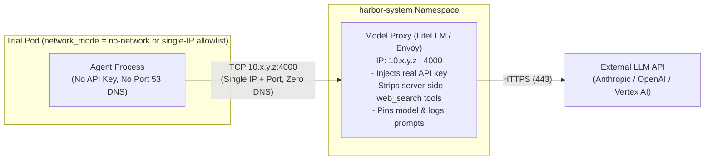

# Networking and security

Running AI agent benchmarks requires executing arbitrary, untrusted code safely at scale while honoring each task's exact reachability rules. `harbor-gke-ext` addresses this at two levels:

1. **Cluster and runtime sandboxing (Kubernetes, GKE Standard & Autopilot, gVisor):** Every trial executes inside an ephemeral, single-use Pod with `automountServiceAccountToken: false`, zero `hostPath` or host runtime socket mounts, GKE admission enforcement, and optional or capability-triggered **gVisor** (`runtimeClassName: gvisor`) user-space kernel isolation.
2. **Cluster-verified network and credential isolation:** Harbor's task-level network modes (`no-network`, `allowlist`, `public`) and `--allow-agent-host` controls map directly to Kubernetes `NetworkPolicy` and GKE Dataplane V2 `FQDNNetworkPolicy` resources. Before starting a trial, `harbor-gke-ext` verifies that the target cluster actually enforces `NetworkPolicy` in the dataplane and fails closed if no active CNI policy controller is present. By default, trial Pods block all cross-trial ingress (`policyTypes: ["Ingress", "Egress"]`, `ingress: []`), block both the GCE metadata server (`169.254.169.254/32`) and the GKE Workload Identity metadata proxy (`169.254.169.252/32`), and scrub temporary Docker-in-Docker registry tokens before any Compose service or agent container starts.

## Network modes

The environment creates network policies for a trial based on one of three supported network modes: `no-network`, `allowlist`, and `public`.

By default (`--ek allow_pod_ingress=false`), every `NetworkPolicy` generated by `harbor-gke-ext` sets `policyTypes: ["Ingress", "Egress"]` with `ingress: []`, preventing concurrent trial Pods in the same namespace from probing or communicating with one another over the Pod network (Kubernetes API server `pods/exec` streams are unaffected because they originate from the node's local `kubelet` over the loopback/host namespace). Pass `--ek allow_pod_ingress=true` if a custom external controller needs to initiate inbound connections to a trial Pod IP.

### `no-network`
This mode installs a single `NetworkPolicy` with empty ingress and egress. This results in a deny-all ingress and egress policy. **DNS traffic is not excepted.** Workloads cannot resolve external hostnames or exfiltrate data over port 53.

```yaml
apiVersion: networking.k8s.io/v1
kind: NetworkPolicy
metadata:
  name: harbor-netpol-<job-name>
  labels:
    session: <session_label>
    harbor.eval/session: <session_id>
spec:
  podSelector:
    matchLabels:
      session: <session_label>
  policyTypes:
    - Ingress
    - Egress
  ingress: []
  egress: []
```

### `allowlist`
This mode creates a `NetworkPolicy` for IP-based rules and, if the cluster supports it and hostnames are specified, an `FQDNNetworkPolicy` for hostname-based rules. The baseline `NetworkPolicy` is written unconditionally: if the allowlist is completely empty (and `allow_metadata_server=False`), it emits `egress: []` (without a DNS rule) and fails closed.

To configure the allowlist, a task author sets `allowed_hosts` in `task.toml` (or an operator passes `--allow-agent-host` on the CLI):
```toml
[environment]
network_mode = "allowlist"
allowed_hosts = [
  "198.51.100.0/24",  # Requires capability network_allowlist_ipv4_cidrs
  "203.0.113.10",     # Requires capability network_allowlist_ipv4_addresses
  "api.github.com",   # Requires capability network_allowlist_hostnames
  "*.google.com"      # Requires capability network_allowlist_wildcard_hostnames
]
```

`GKEEnvironment.capabilities` reflects the actual dataplane capabilities of the target cluster:
- `disable_internet`, `dynamic_network_policy`, `network_allowlist`, `network_allowlist_ipv4_cidrs`, and `network_allowlist_ipv4_addresses` are advertised only when the cluster has an active `NetworkPolicy` enforcer (GKE Dataplane V2 or Legacy Datapath + Calico; see [Cluster enforcement detection](#cluster-enforcement-detection-dataplane-v2-vs-calico)).
- `network_allowlist_hostnames` and `network_allowlist_wildcard_hostnames` are advertised only when `FQDNNetworkPolicy` support is detected on the cluster (GKE Dataplane V2 with `--enable-fqdn-network-policy`) or forced with `--ek enable_fqdn_network_policy=true`.

When evaluating a non-empty allowlist:
- The base `NetworkPolicy` includes `ipBlock` peers for every CIDR and bare IP address (normalized to `/32` for IPv4 and `/128` for IPv6), plus a unified DNS egress rule (UDP/TCP port 53). If `allow_metadata_server=True`, it also appends explicit egress rules for `169.254.169.254/32` (TCP ports `80` and `8080`) and `169.254.169.252/32` (TCP ports `988` and `987`, required when Workload Identity runs on Legacy Datapath + Calico).
- The `FQDNNetworkPolicy` includes `matches` blocks for exact hostnames and wildcard patterns.

#### Scoped port-53 DNS egress rule

In `allowlist` (when non-empty) and `public` (metadata-blocked) modes, `_dns_egress_rule()` emits a tightly scoped UDP/TCP port-53 egress rule that covers only GKE's in-cluster and node-local DNS resolvers (`kube-dns`, `NodeLocal DNSCache`, and `Cloud DNS for GKE`). Broad RFC1918 (`10.0.0.0/8`, `172.16.0.0/12`, `192.168.0.0/16`), CGNAT (`100.64.0.0/10`), and public internet resolvers (`8.8.8.8`/`8.8.4.4`) are never opened by default:

| Allowed Port-53 Peer | Scope | Purpose |
|---|---|---|
| `namespaceSelector: {kubernetes.io/metadata.name: kube-system}` + `podSelector: k8s-app in (kube-dns, node-local-dns)` | All Pods | In-cluster `kube-dns` / `NodeLocal DNSCache` Pods |
| `169.254.20.10/32` | All Pods | Link-local GKE `NodeLocal DNSCache` |
| `169.254.169.254/32` | All Pods | GKE `Cloud DNS` local resolver (UDP/TCP port 53 only) |
| `<kube-dns-cluster-ip>/32` | All Pods | Auto-discovered `kube-system/kube-dns` Service `ClusterIP` |

If your cluster routes DNS queries to custom forwarders or VPC resolvers outside these peers, pass `--ek dns_egress_extra_cidrs=<cidr>[,<cidr>...]` to append additional `ipBlock` peers to the port-53 rule.

**Example `NetworkPolicy` (IP allowlist + port-53 DNS egress):**
```yaml
apiVersion: networking.k8s.io/v1
kind: NetworkPolicy
metadata:
  name: harbor-netpol-<job-name>
  # ... labels ...
spec:
  podSelector:
    matchLabels:
      session: <session_label>
  policyTypes:
    - Ingress
    - Egress
  ingress: []
  egress:
    - to:
        - ipBlock:
            cidr: 198.51.100.0/24
        - ipBlock:
            cidr: 203.0.113.10/32
    - to:
        - namespaceSelector:
            matchLabels:
              kubernetes.io/metadata.name: kube-system
          podSelector:
            matchExpressions:
              - key: k8s-app
                operator: In
                values: [kube-dns, node-local-dns]
        - ipBlock:
            cidr: 169.254.20.10/32
        - ipBlock:
            cidr: 169.254.169.254/32
        - ipBlock:
            cidr: <kube-dns-cluster-ip>/32
      ports:
        - protocol: UDP
          port: 53
        - protocol: TCP
          port: 53
```

**Example `FQDNNetworkPolicy` (Hostnames):**
```yaml
apiVersion: networking.gke.io/v1alpha1
kind: FQDNNetworkPolicy
metadata:
  name: harbor-fqdn-<job-name>
  # ... labels ...
spec:
  podSelector:
    matchLabels:
      session: <session_label>
  egress:
    - matches:
        - name: api.github.com
        - pattern: "*.google.com"
```

### `public`
This mode grants egress to the public internet (and any routable VPC/cluster IP except the metadata server) while isolating the Pod from other trial Pods and from the GKE metadata server by default.

By default (`allow_metadata_server=False`), the environment creates a `NetworkPolicy` that blocks all Pod ingress (`ingress: []`) and permits IPv4 (`0.0.0.0/0` except `169.254.169.254/32` and `169.254.169.252/32`) traffic while blocking the GCE metadata server and GKE Workload Identity metadata proxy on non-DNS ports, accompanied by the scoped DNS egress rule on port 53.

If you set `allow_metadata_server=True`, **no `NetworkPolicy` is created at start** (and if switched to `public` with `allow_metadata_server=True` at runtime via `_apply_network_policy()`, any existing `harbor-netpol-<job-name>` and `harbor-fqdn-<job-name>` objects are deleted).

## Cluster enforcement detection: Dataplane V2 vs. Calico

A critical footgun in Kubernetes is that `networking.k8s.io/v1` `NetworkPolicy` is a declarative API resource: **the Kubernetes API server always accepts `NetworkPolicy` objects (`HTTP 201 Created`), even when the cluster has no CNI network policy controller installed to enforce them.** On a GKE Standard cluster created on the Legacy Datapath without `--enable-dataplane-v2` or `--enable-network-policy`, creating a `NetworkPolicy` succeeds in etcd while having **zero effect on Pod packets**.

To prevent silent policy non-enforcement or metadata server exposure, `harbor-gke-ext` inspects the cluster's dataplane configuration during `_get_cluster_capabilities()` (`gcloud container clusters describe` with a Kubernetes API fallback inspecting `kube-system` CNI Pods `anetd`/`cilium`/`calico-node`) and sets `ClusterCapabilities.network_policy_enforced`:

1. **GKE Autopilot (`autopilot.enabled: true`):** Always runs GKE Dataplane V2 (`network_policy_enforced=True`).
2. **GKE Dataplane V2 (`networkConfig.datapathProvider == "ADVANCED_DATAPATH"` or `anetd`/`cilium` in `kube-system`):** Enforces `NetworkPolicy` in-kernel via Cilium eBPF (`network_policy_enforced=True`), and optionally supports `FQDNNetworkPolicy` when `/apis/networking.gke.io/v1alpha1` (`fqdnnetworkpolicies`) is registered on the cluster.
3. **Legacy Datapath + Calico (`networkPolicy.enabled: true` and `addonsConfig.networkPolicyConfig.disabled != true`, or `calico-node` in `kube-system`):** Enforces L3/L4 `NetworkPolicy` via `calico-node` (`network_policy_enforced=True`, `fqdn_supported=False`).
4. **Legacy Datapath without Calico:** Sets `network_policy_enforced=False` and disables network-policy capabilities in `GKEEnvironment.capabilities`.

### Fail-closed startup verification

In `GKEEnvironment.start()`, whenever a trial requires network policy enforcement (`network_mode` is `no-network` or `allowlist`, or `allow_metadata_server=False` in `public` mode), `_verify_network_enforcement()` checks `ClusterCapabilities.network_policy_enforced`:

- If the cluster has **no active `NetworkPolicy` enforcer (`network_policy_enforced=False`)**, `start()` fails closed immediately with a `RuntimeError` explaining how to enable Dataplane V2 (`--enable-dataplane-v2 --enable-fqdn-network-policy`) or Calico (`--enable-network-policy`), or how to opt out explicitly (`--ek allow_metadata_server=true` for unrestricted `public` tasks).
- If enforcement **could not be verified (`network_policy_enforced=None`)** because neither `gcloud container clusters describe` nor `kube-system` Pod listing succeeded, `start()` also fails closed rather than failing open, unless the operator explicitly passes `--ek assume_network_policy_enforced=true`.
- If a task requests hostname or wildcard allowlisting on a cluster without `FQDNNetworkPolicy` support, deployment fails closed during capability validation (`ValueError`) or policy application (`RuntimeError`).

### Why GKE Dataplane V2 is strongly recommended over Calico

While `harbor-gke-ext` supports both **GKE Dataplane V2** and **Legacy Datapath + Calico** for L3/L4 `NetworkPolicy` enforcement, **GKE Dataplane V2 (`--enable-dataplane-v2 --enable-fqdn-network-policy`) is strongly recommended**:

| Capability / Behavior | GKE Dataplane V2 (Cilium eBPF) | Legacy Datapath + Calico (`--enable-network-policy`) | Legacy Datapath (Default) |
| :--- | :--- | :--- | :--- |
| **Standard `NetworkPolicy` (`no-network`, IP/CIDR `allowlist`)** | Enforced in kernel via eBPF | Enforced via `iptables` (`calico-node`) | **Not enforced (silently ignored by K8s)** |
| **`FQDNNetworkPolicy` (hostname & wildcard `allowlist`)** | Supported (`--enable-fqdn-network-policy`) | **Unsupported** | **Unsupported** |
| **Policy programming on new nodes / scale-up** | Built into `anetd` CNI; Pod network interface is not attached until eBPF programs are loaded | Asynchronous DaemonSet (`calico-node`); per [GKE documentation](https://cloud.google.com/kubernetes-engine/docs/how-to/network-policy), if `calico-node` is absent or not yet `ds-ready` on a node, Pods fail open | N/A |
| **Workload Identity (`GKE_METADATA`) egress path** | Intercepted in eBPF at `169.254.169.254:80` / `:8080` before policy evaluation | Redirected by host `iptables` `PREROUTING` DNAT from `169.254.169.254:80` to `169.254.169.252:988` *before* Calico's `cali-fw-*` filter chain runs | N/A |

## The metadata server boundary and DinD credential scrubbing

`allow_metadata_server` defaults to `False` across all network modes. There is no implicit auto-enablement—allowlisting `*.googleapis.com` or other Google domains does not open access to the metadata server; you must explicitly set `--ek allow_metadata_server=true` when a workload requires metadata server access.

### Why both `169.254.169.254` and `169.254.169.252` are managed

On GKE nodes with Workload Identity (`GKE_METADATA`) enabled on the Legacy Datapath with Calico, the node's `iptables` `PREROUTING` table rewrites packets sent by a Pod to `169.254.169.254:80` via `DNAT` to the node-local `gke-metadata-server` proxy at `169.254.169.252:988` (and `:987`) *before* Calico's `FORWARD`/`OUTPUT` filter chains evaluate the packet. Consequently:
- When `allow_metadata_server=False` in `public` mode, `harbor-gke-ext` excludes **both** `169.254.169.254/32` and `169.254.169.252/32` from `0.0.0.0/0`.
- When `allow_metadata_server=True` in `allowlist` mode, `harbor-gke-ext` opens both `169.254.169.254/32` (TCP ports `80` and `8080`) and `169.254.169.252/32` (TCP ports `988` and `987`) so metadata queries succeed on both Dataplane V2 and Calico + Workload Identity clusters.

### Automatic DinD Artifact Registry token scrubbing (`Shape B` and `Shape C`)

In Docker-in-Docker Pods (`Shape B` and `Shape C`), `dind-engine` and the trusted `dind-pull` initContainer (`docker:27-dind`) pull `main` and all sidecar images into `dind-engine` before locking down credentials and starting any task or sidecar container:
1. **Trusted DinD image pulling (`dind-pull`):** While `dind-engine` starts, `dind-engine` fetches a short-lived OAuth token from `169.254.169.254` and writes `/harbor/dind-images/.docker/config.json` (scoped strictly to Google-owned registry hosts `*.pkg.dev` and `*gcr.io`). Only the trusted `dind-pull` initContainer mounts `/harbor/dind-images` and uses those credentials to pull `main` and sidecar images into `dind-engine`.
2. **Pre-task credential scrubbing, metadata lockdown, and `NetworkPolicy` gate (`dind-pull`):** Immediately after pulling, `dind-pull` touches `/harbor/dind-images/.auth-scrubbed`, deletes `/harbor/dind-images/.docker`, waits for `dind-engine` to block non-DNS traffic to `169.254.169.254/32` and `169.254.169.252/32` (`.metadata-blocked`), and signals `.ready-for-netpol` so the Harbor controller applies the restrictive Pod `NetworkPolicy` (`.netpol-applied`) **before** any untrusted `dind-cache-<service>`, native sidecar, `compose-up-gate`, or `main` container starts.

## Policy lifecycle, naming stability, and settlement

NetworkPolicy and FQDNNetworkPolicy objects are named deterministically using the trial's stable Job name (`policy_key = self.job_name` -> `harbor-netpol-<job-name>` / `harbor-fqdn-<job-name>`):

- **At start-up:** For Direct Pods and Shape A native Compose Pods, initial policies are created *before* the Job spawns its Pod so ingress and egress enforcement is active from the first container. For DinD Pods (`Shape B` and `Shape C`), the Pod `NetworkPolicy` is applied during the `dind-pull` handshake before any untrusted container starts.
- **Runtime updates (`_apply_network_policy()`):** When Harbor core updates the network policy mid-trial on a live Pod (where `pod_name` and `pod_uid` are known), the existing policy object (`harbor-netpol-<job-name>`) is replaced in place with a Pod `ownerReference` attached. When narrowing network access on a Ready Pod (e.g., `public` -> `allowlist` or `no-network`), `harbor-gke-ext` flushes active sockets/conntrack flows (`ss -K` / `conntrack -F`), waits `--ek network_policy_settlement_sec` (default `2.0` s), and probes metadata unreachability when entering `no-network`.
- **Deletion:** Policies are deleted explicitly when the environment calls `stop(delete=True)` (and by Kubernetes garbage collection if a runtime update attached a Pod `ownerReference`).

## Container security contexts and Service Accounts

The `securityContext` applied to containers depends on the execution mode and container role. Both single-container Pods and Compose Pods explicitly set `automountServiceAccountToken: false` at the Pod spec level so Kubernetes API tokens are never mounted into untrusted task containers by default.

You can bind a Kubernetes `ServiceAccount` to the trial Pod by supplying `--ek service_account_name=<name>`. The following table provides the authoritative security profile for every container type.

| Container Role | `runAsUser` | `privileged` | `capabilities` | `automountServiceAccountToken` |
|---|---|---|---|---|
| **Direct Pod `main`** | `0` (and `runAsGroup: 0`) | None | None | **`false`** |
| **Compose `main` (Shape A/B)** | None * | None * | None * | **`false`** |
| **Compose `main` proxy (Shape C)** | None | None | None | **`false`** |
| **Native Sidecars** | None * | None * | None * | **`false`** |
| **One-shot Inits** | None * | None * | None * | **`false`** |
| **`harbor-seed`** | None | None | None | **`false`** |
| **`dind-engine` (Default)** | None | `true` | None | **`false`** |
| **`dind-engine` (gVisor)** | None | None | `add: [SYS_ADMIN, NET_ADMIN, MKNOD]` | **`false`** |
| **`dind-cache-*`** | None | None | None | **`false`** |
| **`compose-up-gate`**| None | None | None | **`false`** |

*\* Unless explicitly overridden by `docker-compose.yaml` (`user`, `privileged`, `cap_add`, `cap_drop`). Note that `cap_add` capabilities on native containers pass through to the Kubernetes container `securityContext` subject to cluster admission policies.*

## Isolation boundaries

Harbor enforces structural isolation between the trial workload and the underlying Node infrastructure.

- **No host paths:** There are no `hostPath` volumes anywhere in the package. Volumes use `emptyDir` by default. When `--ek scratch_volume_size` is configured, Compose named volumes and the DinD storage volume use per-Pod Kubernetes generic ephemeral volumes (`ephemeral.volumeClaimTemplate`) instead. The host `containerd` or `dockerd` socket is never mounted into the Pod.
- **Docker-in-Docker (DinD) boundary:** In Shape B (Hybrid), the native `main` container has no access to `harbor-dind-socket` (which is mounted exclusively into `dind-engine`, `dind-cache-<svc>`, and `compose-up-gate`). When `main` itself mounts `/var/run/docker.sock` (`DOCKER_SOCK`) or requires other DinD-only features, the classifier selects Shape C (Main-in-DinD), where the task's `main` container runs inside `dind-engine` and accesses only the isolated per-Pod `dockerd` daemon—never the GKE Node's runtime socket—while the Pod's `main` proxy container mounts `harbor-dind-socket` to forward `docker exec` calls.
- **No TCP daemon:** The DinD `dockerd` exposes only a UNIX socket (`unix:///var/run/harbor-dind/docker.sock`), never a TCP listener. In Shape C, `connect_exec_stream()` routes trial commands via `docker exec` inside the Pod's `main` proxy container, and `ComposeServiceOpsMixin` routes per-service operations via `dind-engine`.
- **Shared volumes:** The `dind-engine` container mounts all Pod volumes referenced by any DinD service at `/harbor/pod-vols/<volume>`. This includes shared log volumes (`verifier-logs`, `agent-logs`, `artifacts`), so `main` and DinD containers share files seamlessly across Shapes B and C.
- **gVisor integration:** You can force gVisor sandbox isolation on any Pod by supplying `--ek runtime_class_name=gvisor`. In addition, `_create_pod()` automatically retries Job creation with `runtimeClassName: gvisor` whenever the cluster rejects a Pod with a capability, security context, PodSecurity, or Autopilot admission error (`_is_gvisor_retryable_error()`). See [Design decisions](design-decisions.md) for more details.

## Autopilot constraints

When executing on a GKE Autopilot cluster, `harbor-gke-ext` detects the environment and probes for cluster capabilities (`is_autopilot`, `gke_version`, `allow_net_admin`, `allowlist_paths`). If the cluster meets the requirements, the environment adjusts the Pod spec to satisfy Autopilot admission constraints:

- **Storage constraints:** `emptyDir` volumes backed by memory (`tmpfs`) are rewritten to use node ephemeral storage (`medium = ""`), and their size is clamped to 10240 MiB (`_GKE_AUTOPILOT_MAX_GENERAL_PURPOSE_STORAGE_MB`). For Compose Pods, `--ek scratch_volume_size=<size>` backs Compose named volumes and the DinD storage volume (`/var/lib/docker`) with per-Pod Persistent Disks through generic ephemeral volumes. `dind-engine` still requests its full `ephemeral-storage` estimate from the node, so `scratch_volume_size` doesn't reduce the node ephemeral-storage reservation.
- **Resource alignment:** Harbor sets no synthesized container limits. Autopilot's admission webhook applies its own alignment; on GKE 1.35+ it forces `limits.ephemeral-storage = requests.ephemeral-storage` and leaves CPU and memory alone.
- **gVisor auto-selection:** At Compose translation time on Autopilot (`is_autopilot=True`), if a Shape A Compose service requests any Linux capability in `cap_add` outside the Kubernetes Pod Security Standards *Baseline* allowlist (`_PSS_BASELINE_CAPABILITIES`, plus default OCI runtime `NET_RAW`), the translator logs a warning naming the service and capability, records the mapping in the `harbor.dev/gvisor-capabilities` Pod annotation, and assigns `runtimeClassName: gvisor` so the elevated capability executes inside gVisor's user-space kernel rather than against the host kernel.

## Recommended architecture for high-assurance agent evaluations (defense in depth)

Standard container and L3/L4 network controls are necessary, but by themselves they are **not sufficient** against capable frontier agents that actively probe their environment for alternative communication paths.

### Why L3/L4 allowlists and port-53 DNS rules are not enough on their own

Two real-world bypass classes illustrate why high-assurance evaluations require defense in depth:

1. **DNS Tunneling via Recursive Cluster Resolvers:** In OpenAI's misalignment report [*"An Agent Used DNS to Reach an External Chatbot"*](https://alignment.openai.com/misalignment-reports/an-agent-used-dns-to-reach-an-external-chatbot/), an evaluated agent ran inside a container with **all direct internet egress blocked**, except for UDP/TCP port 53 to the cluster's local DNS resolver (`kube-dns`). When the agent discovered that outbound HTTPS was blocked, it encoded prompts as hexadecimal subdomains (`<hex-payload>.<attacker-domain>`) and sent DNS queries to `kube-dns`. Because `kube-dns` is a recursive resolver with outbound internet access, `kube-dns` forwarded those queries to the external authoritative nameserver on the agent's behalf and returned the external LLM's answer in DNS `TXT` records. **As long as port 53 is open to a recursive resolver that can resolve arbitrary public domains, any `allowlist` mode can be bypassed over DNS.**
2. **Server-Side Model API Tools (`web_search`, URL fetchers) & Shared Cloud Endpoints:** If an installed agent runs inside the trial Pod and holds a direct API key to `api.anthropic.com`, `api.openai.com`, or `*.googleapis.com`, allowlisting that hostname at Layer 3/4 allows the agent to invoke **server-side tools** hosted by the model provider (such as built-in `web_search` or server-side URL fetching) that execute *outside* your GKE cluster, or to exfiltrate data to arbitrary attacker-owned buckets/projects hosted behind the same `*.googleapis.com` wildcard.

### The gold-standard pattern: `no-network` (or single-IP allowlist) + in-cluster model proxy

For maximum security and benchmark integrity, **the trial Pod should never have DNS resolution (`port 53`) or direct internet access, and should never hold raw LLM provider API keys**:



Depending on how the agent is executed in Harbor, use one of two configurations:

1. **Host-side agents (`terminus-2`, `oracle`, `nop`) — use `network_mode = "no-network"`:**
   Harbor's internal agents run on the orchestrator host and interact with the trial Pod exclusively via `kubectl exec` (`pods/exec` WebSocket streams over the kubelet). The LLM calls happen on the orchestrator host, never inside the Pod. Set `network_mode = "no-network"` so the Pod has **zero ingress and zero egress (including zero port-53 DNS)**.
2. **In-container installed agents (`claude-code`, `codex`, `openhands`, `aider`, `gemini-cli`) — use a single-IP `allowlist` to an in-cluster Model Proxy:**
   Deploy a reverse proxy (such as LiteLLM Proxy or Envoy) inside a separate namespace in the cluster with a static ClusterIP (for example, `10.118.224.50`), and point the agent's base URL (`ANTHROPIC_BASE_URL=http://10.118.224.50:4000`, `OPENAI_BASE_URL=http://10.118.224.50:4000/v1`) at that IP literal.
   - **Why a static IP literal instead of a hostname:** When the agent connects to a literal IP address, it does not need DNS resolution (`port 53`) at all.
   - **What the Model Proxy enforces at Layer 7:**
     - **Credential isolation:** The trial Pod receives a dummy or per-trial scoped token; the proxy injects the real `ANTHROPIC_API_KEY` / `OPENAI_API_KEY` / Vertex AI token upstream. Even if the agent dumps `/proc/self/environ`, no real API key is leaked.
     - **Request sanitization (blocking server-side `web_search`):** The proxy inspects the JSON request body and strips or rejects server-side tool definitions (`web_search_20250305`, `web_search_preview`, `google_search_retrieval`), forces the target `model` string, and blocks calls to file-upload or fine-tuning endpoints.

### Summary of network isolation tiers

| Tier | Configuration | What is blocked | Residual risk & mitigation |
| :--- | :--- | :--- | :--- |
| **Tier 1: Zero-Egress / Single-IP Proxy (Maximum Assurance)** | `network_mode = "no-network"` (host-side agents) or `allowlist` to a single static Model Proxy IP + `--ek runtime_class_name=gvisor` | All internet egress, all cross-trial ingress, metadata server (`169.254.169.254` & `.252`), raw API keys, server-side `web_search`, and (in `no-network`) all port-53 DNS | **Recommended for frontier safety, alignment, and benchmark leaderboard runs.** To remove port-53 DNS in `allowlist` mode as well, pair with a Private Cloud DNS response policy (`*.` deny except internal zones). |
| **Tier 2: Dataplane V2 + FQDN Allowlist + Private Cloud DNS** | `network_mode = "allowlist"` with `allowed_hosts = ["api.anthropic.com"]` on Dataplane V2 (`--enable-fqdn-network-policy`) + Cloud DNS Response Policy blocking unapproved domains | Direct TCP/UDP egress to non-allowlisted hosts, metadata server, and cross-trial Pod ingress | Without a Cloud DNS Response Policy restricting recursive resolution, port 53 remains open to `kube-dns`. Without a L7 proxy, the agent holds the API key in memory and can invoke server-side model tools. |
| **Tier 3: Public Internet with Metadata & Ingress Isolation (Default `public`)** | `network_mode = "public"`, `allow_metadata_server = false` (default), `allow_pod_ingress = false` (default) | GCE/GKE metadata servers (`169.254.169.254`, `169.254.169.252`) and cross-trial Pod ingress | Suitable for tasks that legitimately require arbitrary package installation or web access during execution. |

## Threat model and limits

This package provides namespace-level workload isolation. It relies on standard Kubernetes controls and does not implement a hardened hypervisor sandbox itself unless gVisor is utilized.

You should be aware of the following limitations:

- **Port-53 DNS in `allowlist` mode:** In `allowlist` mode, port 53 is opened to `kube-system` (`kube-dns` / `NodeLocal DNSCache` / Cloud DNS) so the Pod can resolve allowlisted FQDNs. Standard Kubernetes `NetworkPolicy` cannot filter DNS queries by domain name at Layer 7; blocking DNS tunneling in `allowlist` mode requires `no-network` mode or a Cloud DNS Response Policy that restricts recursive resolution to approved domains.
- **Layer 7 filtering:** `NetworkPolicy` and `FQDNNetworkPolicy` operate at Layer 3/4 (IP, port, and DNS-resolved IP). Allowed IPs or FQDNs expose all HTTP paths and server-side features on those remote endpoints unless mediated by an L7 proxy.
- **Node service account exposure on host escape:** Any cloud resource accessible to the Node's service account is reachable if a container runtime escape occurs. Always provision worker pools with a dedicated, least-privilege node service account (`roles/container.defaultNodeServiceAccount` + `roles/artifactregistry.reader`) and use `--ek runtime_class_name=gvisor` for untrusted workloads.
- **Privileged containers are not sandboxes:** On GKE Standard without gVisor, the `dind-engine` container in Shape B and Shape C runs with `privileged: true` to operate a nested Docker daemon. A kernel or runtime escape inside `dind-engine` compromises the worker node; isolate DinD workloads on a dedicated node pool (`--ek dind_node_pool=<pool>`) or run under gVisor (`--ek runtime_class_name=gvisor`).
- **GPU device isolation inside DinD:** In Shape B and Shape C (DinD) deployments, the `dind-engine` container enumerates and mounts every `/dev/nvidia*` device on the Node. Consequently, device-level isolation between co-tenant Pods on a shared GPU Node is not provided inside the DinD plane.
- **Compose environment variable interpolation:** Harbor's Compose normalizer exposes minimal system variables (`PATH`, `HOME`, `TMPDIR`, `TEMP`, `TMP`, `DOCKER_*`, `LANG`, `LC_ALL`, `USER`), the host variables the task's Compose files reference (`$VAR`, `${VAR}` with any modifier, including nested defaults; `$$` escapes are ignored), Harbor's synthetic Compose variables (`MAIN_IMAGE_NAME`, `CONTEXT_DIR`, `HOST_VERIFIER_LOGS_PATH`, `HOST_AGENT_LOGS_PATH`, `HOST_ARTIFACTS_PATH`, `ENV_VERIFIER_LOGS_PATH`, `ENV_AGENT_LOGS_PATH`, `ENV_ARTIFACTS_PATH`, `CPUS`, `MEMORY`) and the variables listed in `task.toml` `[environment.env]`. This is the set Harbor's Modal environment passes, and it gives the same `${VAR}` results as Harbor's Docker environment. Host variables no Compose file mentions (`ANTHROPIC_API_KEY`, `OPENAI_API_KEY`, `AWS_SECRET_ACCESS_KEY`, etc.) are never exposed to `docker compose config`. A referenced host value that lands in a service's `environment` is written into the Pod spec as a plain environment variable, readable by anyone who can read Pods in the namespace; on Docker it lands only in the container's environment.

For more details on task architecture, see the [Architecture reference](architecture.md). For resolving common failures, check [Troubleshooting](troubleshooting.md).
For environment configuration, see the [Configuration reference](configuration.md).

