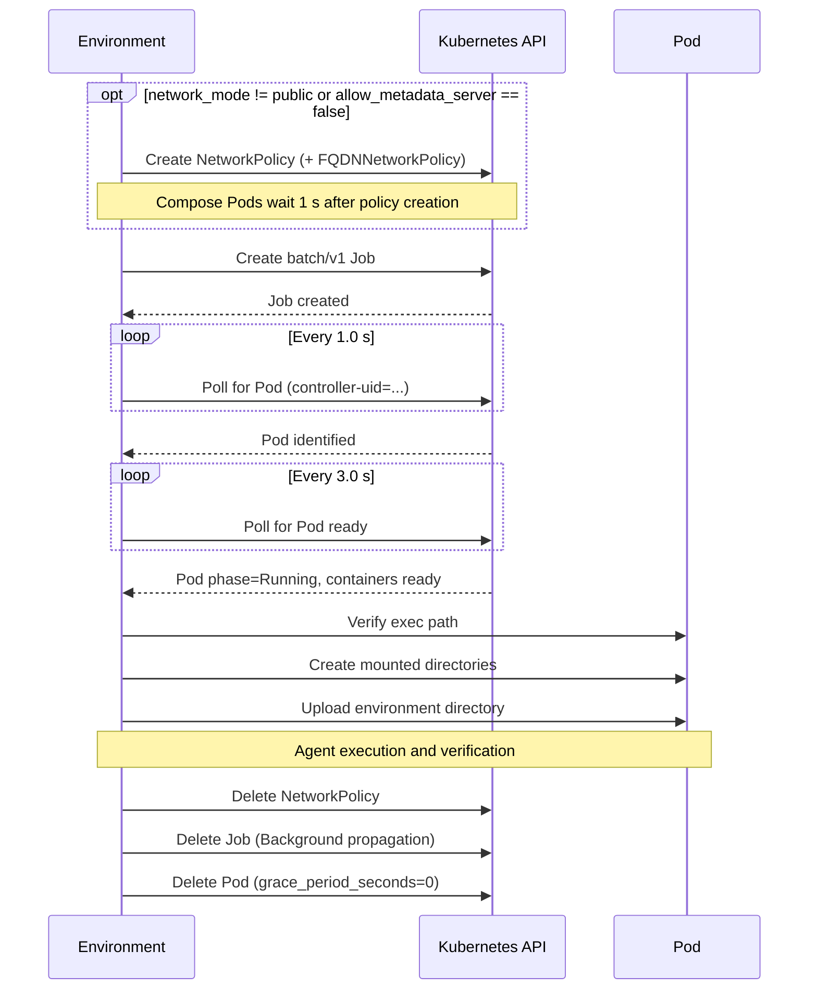

# Runtime and execution

This document serves as the operational reference for what happens while a trial runs in `harbor-gke-ext`. It details the environment lifecycle, execution transports, concurrency limits, and cleanup semantics.

## Trial lifecycle

The trial lifecycle begins when the environment invokes `start()` and ends with `stop(delete=True)`.



## Job and Pod contract

A trial runs as a Kubernetes `batch/v1` Job that wraps exactly one Pod. The environment applies specific fields to ensure trials do not leak or resurrect unexpectedly:

- **`backoffLimit: 3` with a `podFailurePolicy`**: The Job replaces a Pod lost to infrastructure (the `DisruptionTarget` condition: preemption, eviction, node loss) up to `_GKE_JOB_BACKOFF_LIMIT = 3` times. Any non-zero container exit fails the Job, so a crashed or resource-exceeding task is never re-run. `_wait_for_pod_ready()` follows a replacement only during `start()`; after that, exec stays on the original Pod.
- **`ttlSecondsAfterFinished: 120`**: Instructs the cluster control plane to garbage collect the Job and its Pod two minutes after completion.
- **`restartPolicy: Never`**: Ensures that a crashed container terminates the Pod rather than entering a crash loop.
- **`cluster-autoscaler.kubernetes.io/safe-to-evict: "false"`**: This annotation prevents the cluster autoscaler from terminating a running trial during node scale-down events.

### Deadline computation

The environment calculates a strict `spec.activeDeadlineSeconds` bound for both the Job and the Pod through `_resolve_active_deadline_seconds()`. This prevents stalled or orphaned trials from consuming cluster resources indefinitely.

The deadline is the sum of three distinct budgets, each scaled by their respective multipliers, plus a slack buffer, with a minimum floor of `60` seconds (`max(total, 60)`):
1. **Setup budget**: Allocates time for agent setup (default `360` s, scaled by `agent_setup_timeout_multiplier`).
2. **Agent budget**: Allocates time for the agent's main execution (task's `agent.timeout_sec`, or `default_agent_timeout_minutes * 60` — default `1440` min = `86,400` s — when the task omits `agent.timeout_sec`, scaled by `agent_timeout_multiplier`).
3. **Verifier budget**: Allocates time for the verifier step (task's `verifier.timeout_sec` or default `600` s, scaled by `verifier_timeout_multiplier`). The environment omits this budget when the verifier runs in a separate environment. A dedicated verifier Pod (session ID containing `__verifier__`) counts only the setup and verifier budgets.

For multi-step tasks, the environment sums the setup, agent, and verifier budgets across all steps; the setup budget is counted once per step. Finally, it adds `deadline_buffer_minutes` (default `15` minutes = `900` s) of slack to account for image pulls, scheduling delays, and network variability.

**Worked example:**
A task defines a 1800 s agent timeout and a 600 s verifier timeout. With default multipliers and buffers, the calculation is:
`360 s (setup) + 1800 s (agent) + 600 s (verifier) + 900 s (15 min buffer) = 3660 seconds total deadline.`

> [!IMPORTANT]
> Every trial Pod receives a finite `activeDeadlineSeconds` (when a task omits `agent.timeout_sec`, the calculation uses `default_agent_timeout_minutes`, which defaults to 24 hours). You can override the computed value explicitly by setting `--ek active_deadline_seconds=3600`. When a Pod exceeds `activeDeadlineSeconds`, Kubernetes terminates it with `reason="DeadlineExceeded"`, which the environment maps to `TrialContainerLostError` (retryable at the trial level via `--max-retries`).

### gVisor-aware retry

When `_create_pod()` catches an API error during Job creation, `_is_gvisor_retryable_error()` inspects the error message for `gvisor`, `runtimeclassname`, `capabilities`, `privileged`, `podsecurity`, `autopilot`, or `securitycontext`. If matched and `runtime_class_name` is not already `"gvisor"`, `_create_pod()` deletes the failed Job and transparently retries creation with `runtimeClassName: gvisor`.

## Client pooling and concurrency

The environment shares cluster configuration using a `KubernetesClientManager` singleton. `get_client()` and `release_client()` update a reference count under an `asyncio.Lock`. Each `get_client()` call returns its own `CoreV1Api` backed by a dedicated API client.

At high concurrency, parallel trials open thousands of sockets and files. `GKEEnvironment.__init__` invokes `_ensure_file_descriptor_limit(65536)` to raise the process soft `RLIMIT_NOFILE` limit to `min(65536, hard)` (never lowering an already higher limit), averting `Too many open files` errors.

### Adaptive control-plane limiter

Exec handshakes and Job and Pod writes share one process-wide `AdaptiveConcurrencyLimiter` (`control_plane.py`), returned by `get_control_plane_limiter()`. The limiter uses additive-increase, multiplicative-decrease (AIMD) control:

- **Start and ceiling**: `_GKE_CONTROL_PLANE_LIMIT_MAX`, equal to `_GKE_EXEC_SEMAPHORE_LIMIT = 128`. `_GKE_EXEC_SEMAPHORE_LIMIT` also sizes the `ThreadPoolExecutor` (`gke-exec` threads) that runs the blocking handshakes. On a control plane that isn't overloaded, the limit stays at `128`.
- **Decrease**: When `is_control_plane_overload()` classifies an error as overload, the limit is multiplied by `0.5`, down to a minimum of `4`. The limit decreases at most once every `5` seconds, so a burst of simultaneous failures counts once. The environment logs each decrease at `INFO`: `Kubernetes control plane is overloaded; lowering concurrent exec/create limit from 65 to 32.`
- **Increase**: Each `1`-second interval with at least one successful call adds one slot, up to the ceiling. No increase happens during the `5`-second cooldown after a decrease.
- **Waiting**: Calls wait for a slot in first-in, first-out order. Cancelling a waiting call releases its place.

`is_control_plane_overload()` treats the following as overload: HTTP `429` and `503`, and HTTP `5xx` responses that contain `failed calling webhook` (an admission webhook that the API server couldn't call in time, such as the Autopilot webhook described in [Exec admission throughput](autopilot.md#exec-admission-throughput)). Webhook denials (`admission webhook ... denied`) and Konnectivity errors (`no agent available`) are not overload: denials are permanent, and Konnectivity errors come from the node path, so they don't reduce the limit.

Retries after overload use `jittered_backoff_delay()`: `2` seconds doubling to a `20`-second cap, multiplied by a uniform random factor between `0.8` and `1.2` so that clients that failed together don't retry together. Job and Pod creates and deletes go through `_call_control_plane_write()`, which retries overload errors up to `_GKE_CONTROL_PLANE_WRITE_MAX_ATTEMPTS = 10` times. While the environment waits for the Job to create its Pod, `FailedCreate` events caused by a webhook call failure are recorded as overload and the environment keeps polling, because the Job controller retries Pod creation itself.

Because `kubernetes.stream` monkey-patches `api_client.request` while upgrading a connection to WebSocket, `connect_exec_stream()` creates a shallow copy (`copy.copy(core_v1.api_client)`) per handshake so concurrent handshakes on the shared `CoreV1Api` client never race, and bounds the WebSocket upgrade socket timeout to `_GKE_EXEC_HANDSHAKE_TIMEOUT_SEC = 30.0` seconds.

The limiter bounds handshakes in progress, not running commands. Once a handshake completes, the connected socket is handed to a single reactor thread (`gke-exec-reactor`, in `exec_stream.py`). The reactor multiplexes every open exec stream with non-blocking I/O: it reads and parses WebSocket frames, sends stdin, answers server pings, and sends a keepalive ping every `_GKE_EXEC_STREAM_PING_INTERVAL_SEC`. Frames are delivered to the event loop, which decodes output incrementally (UTF-8 characters split across frames stay intact) and awaits output callbacks in order. The number of concurrent commands is therefore not tied to a thread count, and no blocking socket call runs on the event loop.

## Command execution transports

The environment executes commands against the container using two WebSocket-based transport modes.

### Mode A: Direct streaming

Direct WebSocket streaming is the default transport mode. It opens a single WebSocket connection per command and streams output incrementally. This mode provides the lowest latency and places the least load on the Kubernetes API server.

### Mode B: Decoupled polling

You enable decoupled polling by setting `--ek decoupled=true`. It only takes effect when a command is supervised; `exec()` supervises commands by default (`supervised=True`). In this mode, the environment launches the command into the background via a short-lived exec call, then polls a work directory (`/tmp/harbor_<10 hex characters>`, with a sibling `/tmp/harbor_<id>.status` file) for output and exit status.

Use `decoupled=true` for very long-running commands where WebSocket stream longevity across intermediate proxies or Konnectivity tunnels is the primary failure mode—not when Kubernetes API server QPS is the bottleneck, because every decoupled poll requires a new exec handshake.

### Disconnect recovery

When the environment uses Mode A for a supervised command, it implements an automatic recovery path. If the direct WebSocket stream raises a `GKEExecStreamClosedError` mid-command (such as a load balancer or Konnectivity tunnel dropping a connection), the environment transitions into `_poll_decoupled_exec()` and follows the command through its work directory.

Recovery uses a read-only status probe:
- Each probe reports one of `DONE:<rc>`, `DONE_NO_OUTPUT:<rc>`, `RUNNING`, `DEAD`, or `LOST`, and streams any output bytes written beyond the offset already received.
- If `<workdir>/exitcode` exists, the probe reports `DONE:<rc>` and returns the remaining output.
- If the Mode A supervisor already finished, it has recorded the wrapper's `wait` status (for example, `137` after `SIGKILL`) in `<workdir>.status` and removed the work directory. The probe then reports `DONE_NO_OUTPUT:<rc>`.
- If the command wrapper process (PID in `<workdir>/pid`) is gone, the work directory still exists, and neither `<workdir>/exitcode` nor `<workdir>.status` exists, the probe reports `DEAD`, and the environment returns a synthetic exit code of `1`. The probe checks only the wrapper PID, not the supervisor.
- If neither the work directory nor the `.status` file exists, the probe reports `LOST`, which raises `GKEExecStreamClosedError`.
- Because the status probe is read-only, a probe whose response is lost in transit can be safely retried; `_poll_decoupled_exec()` removes the work directory and its `.status` file via a separate exec only after `DONE`, `DONE_NO_OUTPUT`, or `DEAD` is parsed. Probes run as raw execs with the supervisor's identity (no `su` or `cd` wrapping), so process liveness checks see the same process table and permissions as the supervisor.

While the Pod remains alive, the exit code is recovered. Output recovery has a narrow race window if the Mode A supervisor is still running after its stream drops: after the command exits, the supervisor waits for its `tail --pid` followers to exit in the GNU path (bounded by the polling interval of `tail`), or `1.1` seconds in the portable fallback loop, and then removes the work directory. If the supervisor deletes the work directory between two recovery probes, the next probe sees the cached exit code and reports `DONE_NO_OUTPUT:<rc>`, preserving the exact exit code and logging a warning with the recovered byte counts.

### Command timeouts and process-tree termination

In Mode A (direct streaming), the `timeout_sec` clock starts after the WebSocket handshake completes; in Mode B (`decoupled=true`) and during disconnect recovery (`_poll_decoupled_exec()`), elapsed time is measured from `start_time` recorded before launching the command. When `timeout_sec` expires, the command returns exit code `124`:

- **Supervised commands** (commands wrapped with a work directory and PID tracking) execute a remote kill script on timeout and clean up the work directory:
  - Supervised and decoupled commands are launched with `setsid` when the image provides it (util-linux on Debian and Ubuntu, BusyBox on Alpine), so each command leads its own session and process group.
  - The kill script freezes the command's process tree with `SIGSTOP`, then sends `SIGKILL` to the process group and to the descendant process tree. The group kill reaches background processes that were re-parented after their parent exited.
  - Without `setsid`, only the descendant process tree is killed; a background process whose parent already exited can survive.
  - The supervisor waits on the command's wrapper process (`wait`), so it exits as soon as the command exits or is killed and never outlives a killed command. Deleting the work directory doesn't end the wait or change the exit code.
- **Non-supervised commands** (such as lightweight internal probes or stdin uploads) simply close the WebSocket stream on timeout and return exit code `124`.

### `dind_services` exec routing (Shapes B and C)

When a service is placed in `dind_services` (delegated sidecars in Shape B, or `main` and every other Compose service in Shape C), remote operations use two paths depending on the entry point:

- **`connect_exec_stream()` (`env.exec`, `upload_file`, `upload_dir`, `download_file`, `download_dir`)**: Opens the Kubernetes WebSocket exec stream against the Pod's `main` container and wraps the command in:
  ```text
  docker exec [-i] [-t] <service> <command>
  ```
  where `<service>` is the bare Compose service name (`container_name: <service>`, e.g. `main`). This path relies on the Shape C `main` container, a `docker:dind` proxy with `DOCKER_HOST` pointing at `dind-engine`. In Shape B, the Pod's `main` container is the task image without a Docker CLI or `DOCKER_HOST`, so reach delegated sidecars through the service operations below.
- **`ComposeServiceOpsMixin` (`service_exec`, `service_download_file`, `service_download_dir`, `stop_service`)**: The mixin comes from Harbor core, and `_GKENativeComposeServiceTransport` implements the GKE behavior. For DinD-delegated services, it runs `docker --host=unix:///var/run/harbor-dind/docker.sock exec [-w <workdir>] [-u <user>] [-e KEY=VAL ...] <service> sh -c ...` through `env.exec(container="dind-engine")`. Downloads run `docker cp <service>:<path>` into a staging directory under `/var/run/harbor-dind/`, which is then downloaded from `dind-engine`. The mixin has no service upload operations.

Mode A (direct streaming), Mode B (decoupled polling), and tar-based file transfers work transparently across both native Kubernetes containers and inner `dind-engine` containers.

## Resilience and retry budgets

The execution engine and file transfer mechanisms implement specific retry backoff schedules:

| Operation | Max attempts | Backoff schedule | Notes |
|---|---|---|---|
| Exec connect (`connect_exec_stream`) | 15 | `2.0 * (2 ** attempt)` s, capped at 20.0 s, ±20% jitter (about 230 s total wait on average) | Aborts immediately on `TrialContainerLostError` or fatal Pod states. Overload errors also lower the [control-plane limit](#adaptive-control-plane-limiter). `_wait_for_container_exec_ready` uses 18 attempts (about 290 s). |
| Job and Pod create and delete (`_call_control_plane_write`) | 10 | Same schedule as exec connect (about 130 s total wait) | Retries only control-plane overload errors. |
| Decoupled poll / recovery probe | Until command timeout | Initial 2.0 s, multiplier 1.5, cap 15.0 s, ±20% jitter | Transient probe errors (API errors other than 404, network errors, and dropped streams) are retried with the same backoff until the command timeout, with no retry count limit. Without `timeout_sec`, there is no upper bound. HTTP 404 raises `TrialContainerLostError`, and the loop stops when `check_pod_terminated()` reports the Pod or container lost. |
| Upload file (`upload_file`) | 3 | Tenacity `wait_exponential(multiplier=1, min=1, max=10)` (1 s, 2 s) | Preceded by `_wait_for_container_exec_ready` (up to 18 attempts). Excludes `TrialContainerLostError`. |
| Upload directory (`upload_dir`) | 5 | Tenacity `wait_exponential(multiplier=1, min=2, max=30)` (2 s, 2 s, 4 s, 8 s) | Preceded by `_wait_for_container_exec_ready` (up to 18 attempts). Excludes `TrialContainerLostError`. |
| Download (`download_file`, `download_dir`) | 3 | Tenacity `wait_exponential(multiplier=1, min=1, max=10)` (1 s, 2 s) | Excludes `TrialContainerLostError` and `FileNotFoundError` (including `RemoteFileNotFoundError`, raised when the remote `tar` reports a missing path). |
| Inline image build | 3 | Tenacity `wait_exponential(multiplier=2, min=5, max=60)` (5 s, 5 s) | Retries any exception raised by `_build_and_push_image`; the retry has no exception filter. |

### Transport constants

The package configures multiple timeout and keepalive parameters on the underlying REST clients and raw sockets to prevent Konnectivity tunnels and intermediate load balancers from reaping idle connections.

| Constant | Value | Purpose |
|---|---|---|
| `_GKE_EXEC_HANDSHAKE_TIMEOUT_SEC` | 30.0 s | Socket timeout for the WebSocket upgrade handshake |
| `_GKE_EXEC_STREAM_PING_INTERVAL_SEC` | 10.0 s | Application-level WebSocket keepalive pings |
| `_GKE_TCP_KEEPALIVE_IDLE_SEC` | 10 s | OS-level TCP idle threshold |
| `_GKE_TCP_KEEPALIVE_INTERVAL_SEC` | 5 s | OS-level TCP probe interval |
| `_GKE_TCP_KEEPALIVE_COUNT` | 3 | OS-level TCP unacknowledged probe limit |
| `_GKE_API_CONNECT_TIMEOUT_SEC` | 15.0 s | Kubernetes REST API connection timeout |
| `_GKE_API_READ_TIMEOUT_SEC` | 60.0 s | Kubernetes REST API read timeout |

## Readiness and failure diagnosis

The environment blocks on Pod startup using `_wait_for_pod_ready()` with a default `pod_ready_timeout` of `max(1200, build_timeout_sec)` seconds. Job-to-Pod creation is bounded separately by `_GKE_JOB_POD_SPAWN_TIMEOUT_SEC` (`600` seconds). While polling for readiness, if the cluster emits a `NotTriggerScaleUp` warning event for the Pod (for example, when no node pool matches the requested GPU or resource shape), `_wait_for_pod_ready()` fails fast immediately instead of waiting for `pod_ready_timeout`. If the Pod is lost while it starts (it is being deleted, it was disrupted into `Failed`, or it no longer exists), the wait switches to the Pod the Job creates to replace it, within the same `pod_ready_timeout`. When the Job is terminal and will create no more Pods, it raises `TrialContainerLostError` at once.

When the Pod reaches the **Ready** state, `_collect_infra_container_logs()` captures the first 16 KiB of logs from `dind-engine`, `dind-cache-*`, and `compose-up-gate` at debug level.

When a Pod fails to reach the Ready state (or enters phase `Failed`, `Unknown`, or `Error`), the environment automatically gathers diagnostics:
- **`_get_pod_failure_summary()`**: Extracts container exit codes, termination reasons, OOM kills, and `DeadlineExceeded` violations.
- **`_collect_failed_container_logs()`**: Tails the last 80 lines of stdout and stderr for any initContainer or container that exited with a non-zero code.
- **`_check_container_port_collision()`**: Tails the last 100 log lines for `address already in use`, `eaddrinuse`, or `failed to bind to port` indicators and recommends DinD placement if a native port collision occurred.

## File transfer

File transfers operate over a single-hop tar stream via the exec socket. There is no intermediate object store or staging bucket.

- **Upload file**: Builds an uncompressed tar archive in memory and pipes it to `tar xf -` on the Pod. The remote `tar` command limits the read stream using `head -c <bytes>` to ensure deterministic termination.
- **Upload directory**: Uses the Harbor core directory packing utility. It defaults to uncompressed tar creation and preserves file modes, symlinks (as links), and empty directories.
- **Download**: Streams a tar archive from the Pod (`tar cf -`) and extracts it locally in memory. The download logic filters absolute paths and directory traversal attempts.

Transfers do not enforce explicit size caps. Memory on the host dictates the maximum transfer size because archives materialize fully in memory before transmission or extraction.

## Cleanup semantics

The environment relies strictly on resource-scoped lifecycle fields. There is no bulk label-selector cleanup routine in the package. The only `label_selector` usages select the Job's own Pod, during spawn discovery and in `_follow_job_replacement_pod()` when a Pod is lost during `start()`: `batch.kubernetes.io/controller-uid=<Job UID>`, or `job-name=<job>` when the Job UID isn't known. Selecting by UID keeps a trial from adopting a terminating Pod left behind by an earlier Job with the same name.

> [!WARNING]
> Because there is no bulk cleanup, terminating the Harbor process forcibly (`SIGKILL`) leaves the deletion of active trial resources to Kubernetes deadline and TTL controllers.

What this means for an operator:
- The `activeDeadlineSeconds` field (always set on every Job and Pod via `_resolve_active_deadline_seconds()`) terminates orphaned running Pods once their trial time budget expires, because `main` runs `sleep infinity` (or `docker wait main`) and will not exit on its own.
- The `ttlSecondsAfterFinished: 120` field reclaims the Job and Pod two minutes after the Job finishes (either normally or via `activeDeadlineSeconds`).
- Start-time `NetworkPolicy` and `FQDNNetworkPolicy` objects (created before the Pod UID exists) do not carry `ownerReferences` unless updated at runtime; if the Harbor process is killed with `SIGKILL` before `stop(delete=True)` runs, stale `harbor-netpol-*` / `harbor-fqdn-*` policies may remain in the namespace until deleted manually.
- The `CloudBuildPlugin.on_job_end` method is an explicit no-op.

For related setup and operational details, see the [Configuration reference](configuration.md), [Architecture](architecture.md), [Docker in Docker](docker-in-docker.md), [Cluster setup](cluster-setup.md), and [Troubleshooting](troubleshooting.md).
